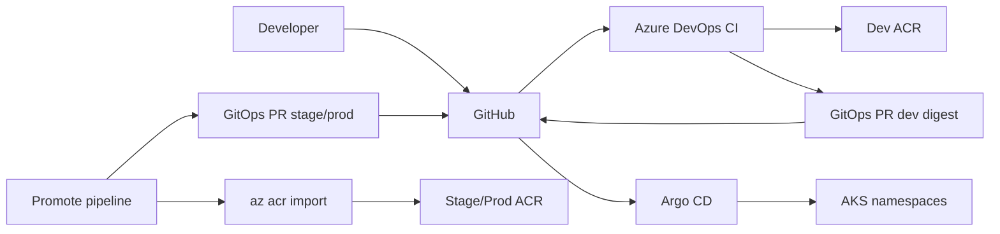

# Architecture

System design for **Online Boutique on Azure**: one AKS cluster, three logical environments, Terraform foundation, Azure DevOps CI, Argo CD GitOps, and per-environment container registries.

Extended design notes (naming, cost, ADRs): [docs/architecture-design.md](docs/architecture-design.md).

## Goals

- Infrastructure as code (Terraform) with remote state.
- **Build once, promote by digest** — `az acr import` across dev → stage → prod ACRs; no rebuild on promote.
- GitOps CD (Argo CD app-of-apps); prod changes require PR review and **manual** Argo sync.
- HTTPS via NGINX Ingress, cert-manager (DNS-01), external-dns on Azure DNS.
- Namespace isolation: quotas, NetworkPolicies, Pod Security labels.
- Observability: kube-prometheus-stack (Prometheus, Grafana, Alertmanager).

**Out of scope (v1):** multi-region active-active, service mesh, compliance certifications.

## Context

### Diagrams (PNG)

- [Platform overview](docs/diagrams/00-platform-overview.png)
- [CI/CD flow](docs/diagrams/01-cicd-flow.png)
- [Azure resources](docs/diagrams/02-azure-resources.png)
- [Inside cluster](docs/diagrams/03-inside-cluster.png)

## Azure topology

| Layer | Resources (convention) |
|-------|-------------------------|
| State | Storage account from `infra/terraform/envs/bootstrap` |
| Shared | VNet, Log Analytics, Azure DNS zone, AKS `aks-boutique-weu`, static ingress IP |
| Per env | RG, ACR (`acrboutiquedevweu` / `acrboutiquestageweu` / `acrboutiqueprodweu`), Key Vault, private endpoints |

Terraform apply order: [DEPLOYMENT.md — Terraform](DEPLOYMENT.md#terraform-apply-order).

## Cluster layout

One AKS cluster; workloads in namespaces **`dev`**, **`stage`**, **`prod`**.

Platform namespaces (shared): `ingress-nginx`, `cert-manager`, `external-dns`, `monitoring`, `argocd`.

| Mechanism | Purpose |
|-----------|---------|
| Namespaces + AppProjects | Argo CD scope per environment |
| ResourceQuota / LimitRange | `gitops/platform/<env>/` |
| NetworkPolicy | Default-deny + baseline ingress/egress |
| Pod Security | `baseline` (dev), `restricted` (stage/prod) |
| Separate ACR per env | Kubelet pulls only from env registry |

## Application scope (v1)

| Track | Workloads |
|-------|-----------|
| **Owned (CI + charts)** | `frontend`, `cartservice`, `currencyservice`, `productcatalogservice`, `redis-cart` |
| **Upstream images (optional)** | `checkoutservice`, `emailservice`, `paymentservice`, `shippingservice`, `recommendationservice`, `loadgenerator` |
| **Later** | `adservice`, full demo topology |

Only **frontend** typically has a public Ingress; other owned services are `ClusterIP`.

## CI/CD and GitOps

| Step | Tool | Artifact |
|------|------|----------|
| Build / scan / push | Azure DevOps `pipelines/ci/*.yml` | Image in **dev** ACR; PR updates `gitops/envs/dev/values-*.yaml` |
| Promote | `pipelines/promote/promote-to-*.yml` | `az acr import` + PR to stage/prod values |
| Deploy | Argo CD | Helm charts in `charts/`, values in `gitops/envs/` |

GitOps layout: [gitops/README.md](gitops/README.md). Pipeline details: [pipelines/README.md](pipelines/README.md).

Promotion RBAC pre-check: [DEPLOYMENT.md — Promotion SP roles](DEPLOYMENT.md#promotion-service-principal-roles).

## Observability

- **kube-prometheus-stack** in namespace `monitoring`.
- Ingress metrics for 5xx alerts; cert-manager metrics for expiry alerts.
- Dashboards and alert routing: [docs/runbooks/grafana-dashboards.md](docs/runbooks/grafana-dashboards.md).

## Repository map

| Path | Role |
|------|------|
| `infra/terraform/` | Modules and env roots |
| `gitops/bootstrap/` | Root Argo app + child Applications |
| `gitops/apps/` | Per-service and platform Applications |
| `gitops/envs/` | Helm values (image digest per env) |
| `charts/` | Helm charts |
| `pipelines/` | CI and promote YAML |

## Related docs

- [DEPLOYMENT.md](DEPLOYMENT.md) — how to build and run the platform
- [SECURITY.md](SECURITY.md) — controls and prod gates
- [ROADMAP.md](ROADMAP.md) — planned changes
