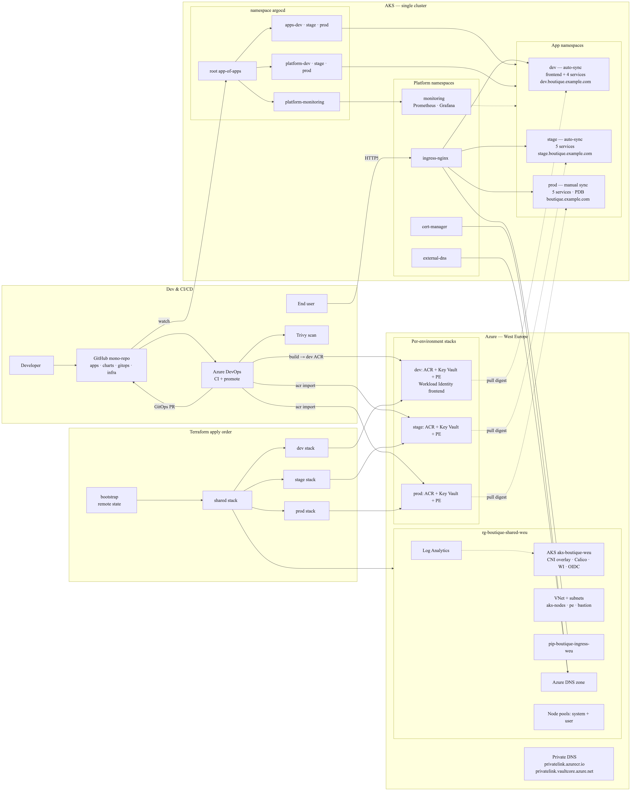
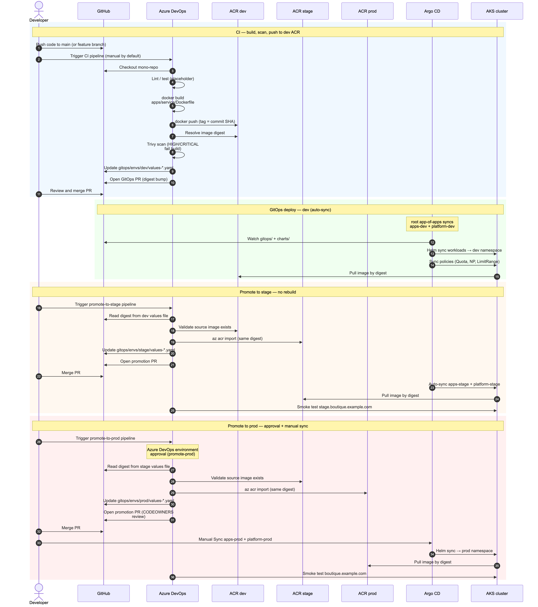

# Architecture

System design for **Online Boutique app on Azure**: one AKS cluster, three logical environments, Terraform foundation, Azure DevOps CI, Argo CD GitOps, and per-environment container registries.

Extended design notes (naming, cost, ADRs): [docs/architecture-design.md](docs/architecture-design.md).

## Goals

- Infrastructure as code (Terraform) with remote state.
- **Build once, promote by digest** — `az acr import` across dev → stage → prod ACRs; no rebuild on promote.
- GitOps CD (Argo CD app-of-apps); prod changes require PR review and **manual** Argo sync.
- HTTPS via NGINX Ingress, cert-manager (DNS-01), external-dns on Azure DNS.
- Namespace isolation: quotas, NetworkPolicies, Pod Security labels.
- Observability: kube-prometheus-stack (Prometheus, Grafana, Alertmanager).

Non-goals: [ROADMAP.md — Non-goals](ROADMAP.md#non-goals).

## Architecture diagrams

### Infrastructure diagram

End-to-end platform: Terraform, Azure resources, AKS namespaces, workloads, CI/CD, and GitOps.

### CI/CD sequence

Build in dev, promote by digest, GitOps PRs, Argo CD deploy.

| More | Link |
|------|------|
| Mermaid (editable) | [docs/architecture-design.md §5](docs/architecture-design.md#5-high-level-architecture) |
| Tool reference | [docs/architecture-diagram.md](docs/architecture-diagram.md) |
| All assets | [docs/diagrams/README.md](docs/diagrams/README.md) |

**Cluster bootstrap (important):** Phase 2 installs ingress, cert-manager, external-dns, monitoring, and Argo CD with **`helm upgrade --install`** first. The Argo root app then syncs `gitops/bootstrap/applications/` (workloads and `gitops/platform/` policies)—it does not reinstall those Helm charts. Details: [docs/implementation/phase-02-cluster-bootstrap.md](docs/implementation/phase-02-cluster-bootstrap.md).

## Azure topology

| Layer | Resources (convention) |
|-------|-------------------------|
| State | Storage account from `infra/terraform/envs/bootstrap` |
| Shared | VNet, Log Analytics, Azure DNS zone, AKS `aks-boutique-weu`, static ingress IP |
| Per env | RG, ACR (`acrboutiquedevweu` / `acrboutiquestageweu` / `acrboutiqueprodweu`), Key Vault, private endpoints |

Terraform apply order: [DEPLOYMENT.md — Terraform](DEPLOYMENT.md#terraform-apply-order).

## Cluster layout

One AKS cluster; workloads in namespaces **`dev`**, **`stage`**, **`prod`**.

Platform namespaces (shared): `ingress-nginx`, `cert-manager`, `external-dns`, `monitoring`, `argocd`.

| Mechanism | Purpose |
|-----------|---------|
| Namespaces + AppProjects | Argo CD scope per environment |
| ResourceQuota / LimitRange | `gitops/platform/<env>/` |
| NetworkPolicy | Default-deny + baseline ingress/egress |
| Pod Security | `baseline` (dev), `restricted` (stage/prod) |
| Separate ACR per env | Kubelet pulls only from env registry |

## Application scope (v1)

| Track | Workloads |
|-------|-----------|
| **Owned (CI + charts)** | `frontend`, `cartservice`, `currencyservice`, `productcatalogservice`, `redis-cart` |
| **Upstream images (optional)** | `checkoutservice`, `emailservice`, `paymentservice`, `shippingservice`, `recommendationservice`, `loadgenerator` |
| **Later** | `adservice`, full demo topology |

Only **frontend** typically has a public Ingress; other owned services are `ClusterIP`.

## CI/CD and GitOps

| Step | Tool | Artifact |
|------|------|----------|
| Build / scan / push | Azure DevOps `pipelines/ci/*.yml` | Image in **dev** ACR; PR updates `gitops/envs/dev/values-*.yaml` |
| Promote | `pipelines/promote/promote-to-*.yml` | `az acr import` + PR to stage/prod values |
| Deploy | Argo CD | Helm charts in `charts/`, values in `gitops/envs/` |

GitOps layout: [gitops/README.md](gitops/README.md). Pipeline details: [pipelines/README.md](pipelines/README.md).

Promotion RBAC pre-check: [DEPLOYMENT.md — Promotion SP roles](DEPLOYMENT.md#promotion-service-principal-roles). Identity, Key Vault, and Workload Identity: [SECURITY.md — Identity, RBAC, and secrets](SECURITY.md#identity-rbac-and-secrets). Key Vault CSI v1 (frontend): [docs/secrets/key-vault-csi-v1.md](docs/secrets/key-vault-csi-v1.md).

## Observability

- **kube-prometheus-stack** in namespace `monitoring`.
- Ingress metrics for 5xx alerts; cert-manager metrics for expiry alerts.
- Dashboards and alert routing: [docs/runbooks/grafana-dashboards.md](docs/runbooks/grafana-dashboards.md).

Repository layout: [README.md — Repository layout](README.md#repository-layout).
