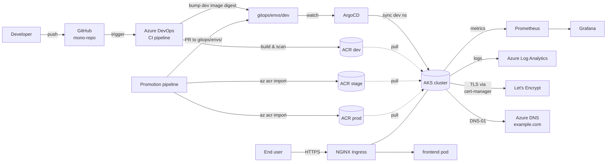

# Architecture & Design Document
## CI/CD Pipeline for Google Online Boutique on Azure

**Owner:** *(your name — set when you fork this repo)*
**Created:** 2026-05-03
**Status:** Draft v2 (per-env ACR redesign)
**Companion doc:** `cicd-pipeline-plan.md`

> **What changed from v1:** Image registry layout switched from a single shared ACR to **one ACR per environment**. Sections affected: §6 Network, §8 ACR, §9 Identity, §11 CI/CD (promotion model), §15 Naming, §17 Cost, plus new ADR-008.

---

## 1. Executive summary

This document describes the target architecture for deploying Google's *Online Boutique* microservices demo to Azure, with a fully automated CI/CD pipeline driven by Azure DevOps and ArgoCD. A single multi-tenant AKS cluster in West Europe hosts three logical environments (dev, stage, prod) isolated by namespaces, node pools, RBAC, network policies, and resource quotas. Infrastructure is provisioned with Terraform; applications and platform components are deployed via Helm and ArgoCD using a GitOps app-of-apps pattern. Container images live in **three environment-scoped Azure Container Registries** — promotion between environments happens via `az acr import` of an immutable digest, not by rebuilding. Ingress is HTTPS-only via NGINX + cert-manager + Let's Encrypt against the `example.com` zone in Azure DNS. Secrets live in Azure Key Vault and surface in pods via the CSI Secrets Store driver. Observability is delivered by the kube-prometheus-stack.

---

## 2. Goals & non-goals

### Goals

- Reproducible, code-defined infrastructure (Terraform).
- Push-to-deploy CI for every microservice (Azure DevOps → dev ACR).
- Pull-based GitOps CD with environment promotion gates (ArgoCD).
- "Build once, promote artifact" — same digest flows from dev ACR → stage ACR → prod ACR.
- HTTPS everywhere with automatic certificate rotation.
- Per-environment isolation strong enough to keep prod safe from dev mistakes within one cluster.
- Centralized observability with sensible default alerts.
- Operate the whole demo for under a defined monthly budget (target stated in §17).

### Non-goals

- Multi-region active-active.
- Hosting non-demo workloads on the same cluster.
- Replacing application code in Online Boutique.
- Service mesh (Istio/Linkerd) — out of scope for v1.
- Compliance certifications.

---

## 3. Application overview — Online Boutique

Online Boutique is an 11-service polyglot e-commerce demo plus Redis. All services communicate via gRPC except the frontend (HTTP).

### v1 scope (this repository)

**Owned in v1 (CI + per-env ACR + Helm in this repo):** **five workloads** — four microservices (`frontend`, `cartservice`, `currencyservice`, `productcatalogservice`) plus **Redis** as `redis-cart` (matches the charts under `charts/`). There is **no** extra “backend” service in the upstream demo; that stand-in has been removed from this repo.

**Upstream Google images in v1 (not built here):** `checkoutservice`, `emailservice`, `paymentservice`, `shippingservice`, `recommendationservice`, and **`loadgenerator`** — deploy from the official microservices-demo container images (e.g. in a dedicated namespace). **`adservice`** is out of this v1 upstream slice unless you add it later.

| Service | Language | Role |
|---|---|---|
| `frontend` | Go | HTTP web UI; only externally exposed service |
| `cartservice` | C# | Shopping cart (uses Redis) |
| `productcatalogservice` | Go | Product list |
| `currencyservice` | Node.js | Currency conversion |
| `paymentservice` | Node.js | Charges (mocked) |
| `shippingservice` | Go | Shipping quotes & tracking |
| `emailservice` | Python | Order confirmations (mocked) |
| `checkoutservice` | Go | Orchestrates checkout |
| `recommendationservice` | Python | Product recommendations |
| `adservice` | Java | Contextual ads |
| `loadgenerator` | Python (Locust) | Synthetic traffic (dev/stage only) |
| `redis-cart` | Redis | Cart store |

Implications:
- Multiple language toolchains in CI.
- Only `frontend` needs an Ingress with TLS; everything else is `ClusterIP`.
- `loadgenerator` is disabled in prod via Helm values.
- `redis-cart` is in-cluster for the demo.

### 3.1 Implementation scope (v1)

The repo currently owns **6 services in-tree** with their own Dockerfiles, Helm charts, CI pipelines, and ArgoCD applications:

| In-tree (owned) | Status |
|---|---|
| `frontend` | ✅ chart, CI, gitops |
| `cartservice` | ✅ chart, CI, gitops |
| `productcatalogservice` | ✅ chart, CI, gitops |
| `currencyservice` | ✅ chart, CI, gitops |
| `redis-cart` | ✅ chart, CI, gitops |
| `backend` *(custom service, added beyond Online Boutique)* | ✅ chart, CI, gitops, dedicated promotion pipelines |

The remaining **5 services + loadgenerator** are deployed via Google's upstream container images and overlay-only Helm values (no in-tree Dockerfile or CI):

| Upstream-image (overlay only) |
|---|
| `paymentservice` · `shippingservice` · `emailservice` · `checkoutservice` · `recommendationservice` · `adservice` · `loadgenerator` |

When/if the team wants build control over these, follow the pattern of the in-tree services to add chart + CI + GitOps app. The CI/CD plan's Phase 5 ("fan-out") refers to that follow-on work.

---

## 4. Environment & isolation model

One physical AKS cluster, three logical environments. Isolation layers:

```
┌─────────────────────────────────────────────────────────────┐
│ AKS cluster: aks-boutique-weu                               │
│                                                             │
│  ┌─────────────┐   ┌─────────────┐   ┌─────────────┐        │
│  │ ns: dev     │   │ ns: stage   │   │ ns: prod    │        │
│  │ pulls from  │   │ pulls from  │   │ pulls from  │        │
│  │ acr-dev     │   │ acr-stage   │   │ acr-prod    │        │
│  │ Quota:S     │   │ Quota:M     │   │ Quota:L     │        │
│  │ NetPol:open │   │ NetPol:tight│   │ NetPol:deny │        │
│  └─────────────┘   └─────────────┘   └─────────────┘        │
│                                                             │
│  Shared platform namespaces:                                │
│  argocd · ingress-nginx · cert-manager · monitoring         │
└─────────────────────────────────────────────────────────────┘
```

**Per-environment separation mechanisms:**

1. **Namespaces** — `dev`, `stage`, `prod`. Platform components in their own namespaces.
2. **Node pools** — Baseline is `system` + untainted `user` pool. The `user` pool hosts shared platform components (ingress, cert-manager, external-dns, monitoring, Argo CD) and general workloads. Optional tainted pools (`npdev`, `npstg`, `npprod`) can be enabled later for stricter environment placement using tolerations + nodeSelectors.
3. **RBAC** — Azure AD groups bound to namespace-scoped Roles. Devs get edit on dev, read on stage, none on prod.
4. **Per-environment ACR** — `acr-dev`, `acr-stage`, `acr-prod`; each environment can only pull from its own registry.
5. **NetworkPolicies** — default-deny per namespace; explicit allow rules per service. No cross-environment traffic.
6. **ResourceQuotas + LimitRanges** — cap CPU/memory per env.
7. **Pod Security Standards** — `baseline` in dev, `restricted` in stage and prod.
8. **Separate Helm values files** — `values-dev.yaml`, `values-stage.yaml`, `values-prod.yaml` (each pointing at its env-specific registry).
9. **Separate ArgoCD Applications and Projects** — different sync policies per env.

ADR-001 captures the single-cluster-for-prod trade-off (§19).

---

## 5. High-level architecture

> **Canonical diagrams (PNG):** [infrastructure-diagram.png](diagrams/infrastructure-diagram.png) and [architecture-cicd-sequence.png](diagrams/architecture-cicd-sequence.png).



Key flow: **CI builds & pushes to dev ACR only**. Promotion to stage/prod is a separate pipeline that imports the same image **digest** to the target ACR and bumps the GitOps values file.

---

## 6. Network architecture

Single VNet for the whole stack; AKS uses **Azure CNI Overlay**.

| Subnet | CIDR | Purpose |
|---|---|---|
| `snet-aks-nodes` | 10.20.1.0/24 | AKS node IPs |
| `snet-pe` | 10.20.2.0/27 | Private endpoints for **3 ACRs + 3 Key Vaults** |
| `snet-bastion` | 10.20.3.0/27 | Optional Azure Bastion |

Pod overlay CIDR: `10.244.0.0/16`. Service CIDR: `10.0.0.0/16`.

**Private endpoints:**
- 3 × ACR private endpoints → one per env-scoped registry.
- 3 × Key Vault private endpoints → one per env vault.
- Two private DNS zones linked to the VNet:
  - `privatelink.azurecr.io` (covers all three ACR PEs).
  - `privatelink.vaultcore.azure.net` (covers all three KV PEs).

**NSG rules** — deny-all by default on node subnet; allow:
- 443 inbound from Internet only on the Public IP attached to the NGINX `LoadBalancer` Service.
- Egress to ACRs and Key Vaults via their private endpoints (no public egress for those).
- Egress to Azure metadata + control plane.

**DNS:**
- Public zone `example.com` in Azure DNS.
- Records created by **external-dns** based on Ingress hostnames.
- Hosts: `boutique.example.com` (prod), `stage.boutique.example.com`, `dev.boutique.example.com`. Argo/Grafana on `argocd.example.com` and `grafana.example.com`.

---

## 7. AKS cluster design

| Property | Value |
|---|---|
| Name | `aks-boutique-weu` |
| Region | `westeurope` |
| Kubernetes version | latest stable patch of the minor version one behind newest GA |
| Network plugin | Azure CNI Overlay |
| Network policy | Calico |
| Identity | Azure AD-integrated, RBAC enabled, Workload Identity enabled |
| Private cluster | No (simpler for the demo); restrict API server to your IP |
| Auto-upgrade | `patch` channel, weekend maintenance window |
| Add-ons | Azure Monitor for containers, Key Vault secrets provider, OIDC issuer |

**Node pools:**

| Pool | SKU | Min/Max | Taints | Purpose |
|---|---|---|---|---|
| `system` | Standard_D2s_v5 | 2/3 | `CriticalAddonsOnly=true:NoSchedule` | AKS system / `kube-system` critical add-ons only |
| `user` | Standard_B2s | 1/3 | (none) | Ingress, cert-manager, external-dns, monitoring, Argo CD, unscoped workloads |
| `npdev` | Standard_B2s | 1/3 | `env=dev:NoSchedule` | dev workloads |
| `npstg` | Standard_D2s_v5 | 1/3 | `env=stage:NoSchedule` | stage workloads |
| `npprod` | Standard_D2s_v5 | 2/4 | `env=prod:NoSchedule` | prod workloads, multi-AZ |

Cluster autoscaler ON for `system` and `user` pools by default; optional env pools (`npdev`, `npstg`, `npprod`) are autoscaled when enabled. Ubuntu nodes; ephemeral OS disks.

---

## 8. Container registries — one ACR per environment

Three Standard-tier registries, each in its own resource group for clean RBAC boundaries:

| Registry | Resource group | Tier | Purpose |
|---|---|---|---|
| `acrboutiquedevweu` | `rg-boutique-dev-weu` | Standard | Receives **all** CI builds; dev pulls only from here |
| `acrboutiquestageweu` | `rg-boutique-stage-weu` | Standard | Receives images **imported** from dev once promoted |
| `acrboutiqueprodweu` | `rg-boutique-prod-weu` | Standard | Receives images **imported** from stage once promoted |

> ACR names are global and must be alphanumeric only; the `weu` suffix keeps them region-tagged.

**Repo layout (identical in each registry):**
```
acrboutique<env>weu.azurecr.io/
  boutique/frontend
  boutique/cartservice
  ...
```

**Tagging & references:**
- CI tags as `<git-sha>` and `<branch>-latest`.
- **Helm values pin the image by digest** (`@sha256:...`), not by tag, so promotion is binary-identical and immutable.
- The Helm chart resolves the image as `{{ .Values.global.registry }}/boutique/<service>@{{ .Values.image.digest }}`, so each env's `values-<env>.yaml` only differs in `registry` and `digest`.

**Image promotion (build once, promote artifact):**
1. CI builds and pushes to `acrboutiquedevweu` only.
2. ArgoCD auto-syncs dev → image runs in dev namespace.
3. **Promotion pipeline** (Azure DevOps, manual trigger or PR-merge trigger):
   ```bash
   az acr import \
     --name acrboutiquestageweu \
     --source acrboutiquedevweu.azurecr.io/boutique/<svc>@<digest> \
     --image boutique/<svc>@<digest>
   ```
4. Same pipeline opens a PR bumping `gitops/envs/stage/values-<svc>.yaml` to point at the new digest in the stage registry.
5. After PR approval and merge, ArgoCD syncs stage.
6. Repeat to promote stage → prod.

This pattern guarantees that what's tested in stage is **byte-identical** to what runs in prod — no rebuild, no race conditions on tags. ADR-008 details the choice.

**Access:**
- AKS kubelet identity has `AcrPull` on **all three** registries (kubelet pulls images, not pods, so per-namespace pull RBAC isn't possible without imagePullSecrets — we deliberately keep the kubelet-identity model and rely on the values file's `registry:` field to direct each env to its own ACR).
- Azure DevOps push: dev pipeline service connection has `AcrPush` on `acrboutiquedevweu` only.
- Azure DevOps promote: the promotion pipeline's service connection has `Reader` + `import` on dev/stage and `AcrPush` + `import` on stage/prod.
- Repo-level RBAC scoped to `boutique/*`.
- Vulnerability scanning: Microsoft Defender for Containers on every registry.
- Retention: untagged manifests deleted after 14 days in dev; **never auto-delete** in stage and prod.

---

## 9. Identity, RBAC, secrets

**Operational guide (recommended):** [SECURITY.md](../SECURITY.md#identity-rbac-and-secrets) — clear explanation of CI SP, kubelet, Workload Identity, Key Vault, Git, and Argo CD controls as implemented in this repo.

**Design summary:**

**Azure side**

- AAD groups (target): `g-boutique-devs`, `g-boutique-leads`, `g-boutique-sre` — namespace-scoped Kubernetes access via group bindings.
- **Per-env UAMIs** (`id-boutique-dev/stage/prod`): federated to app ServiceAccounts; **Key Vault Secrets User** on matching vault (`kv-boutique-*-weu`).
- **Platform UAMIs:** cert-manager and external-dns — **DNS Zone Contributor** on the Azure DNS zone (see Phase 2).
- **AKS kubelet identity:** **AcrPull** on all three env ACRs (Terraform + `az aks attach-acr`).
- **CI / promotion SP** (`promotion-azure-connection`): **AcrPush** on dev ACR for builds; promotion roles on source/target ACRs and **Reader** on stage/prod RGs — [DEPLOYMENT.md](../DEPLOYMENT.md#promotion-service-principal-roles).

**Kubernetes side**

- Azure AD integration ON; optional ClusterRoleBindings keyed off AAD group object IDs.
- Per-namespace Roles: e.g. `dev-edit`, `stage-edit` (leads), `prod-view` (devs), `prod-edit` (SRE).
- ServiceAccounts annotated with `azure.workload.identity/client-id` for pods that call Azure APIs.

**Secrets**

- One Key Vault per env; **CSI Secrets Store driver** mounts secrets — no secrets in Git.
- Pipeline tokens (`GITHUB_TOKEN`) live in Azure DevOps Library only.

---

## 10. Ingress, DNS, and HTTPS

**NGINX Ingress Controller** in namespace `ingress-nginx`. One Service of type `LoadBalancer` with a static Azure Public IP (created in Terraform) so DNS records are stable.

**cert-manager** in namespace `cert-manager`. Two ClusterIssuers:
- `letsencrypt-staging` — for testing.
- `letsencrypt-prod` — production certs.

Both use **DNS-01 challenge** against Azure DNS via a UAMI with `DNS Zone Contributor` on `example.com`. Wildcard certs per env.

**External-dns** in namespace `external-dns`, manages A records under `example.com` based on Ingress annotations.

**Hostnames:**
| Env | Hostname | Cert |
|---|---|---|
| dev | `dev.boutique.example.com` | wildcard `*.dev.boutique.example.com` |
| stage | `stage.boutique.example.com` | wildcard `*.stage.boutique.example.com` |
| prod | `boutique.example.com` | wildcard `*.boutique.example.com` |
| ops | `argocd.example.com`, `grafana.example.com` | per-host |

All HTTP requests are 301-redirected to HTTPS by NGINX.

---

## 11. CI/CD architecture

### CI — Azure DevOps (per microservice)

```
[trigger: push to main, paths: apps/<service>/**]
         ▼
┌─────────────────────────────────────────────┐
│ 1. Lint & unit test                         │
│ 2. Build container (multi-stage Dockerfile) │
│ 3. Trivy scan — fail on HIGH/CRITICAL       │
│ 4. Push to ACR DEV with tag = <git-sha>     │
│ 5. Capture image digest                     │
│ 6. Open PR in gitops/envs/dev/              │
│    bumping image.digest for the service     │
└─────────────────────────────────────────────┘
```

- Service connections use **Workload Identity Federation** — no PATs.
- Pipeline templates in `pipelines/templates/` for shared steps.
- PR validation pipelines run on every PR (lint + test, no push).
- Output: image digest in `acrboutiquedevweu`.

### Promotion — Azure DevOps (per env transition)

A separate pipeline `pipelines/promote/promote-to-<env>.yml`, triggered manually or by merge of a "promote" PR:

```
[trigger: manual or PR merge with label "promote-to-stage"]
         ▼
┌─────────────────────────────────────────────────────────┐
│ 1. Resolve source digest from gitops/envs/dev           │
│ 2. az acr import to acrboutiquestageweu                 │
│ 3. Run smoke tests against the existing stage env       │
│ 4. Open PR in gitops/envs/stage/ bumping image.digest   │
│    + image.registry to acrboutiquestageweu              │
└─────────────────────────────────────────────────────────┘
```

Same shape for `promote-to-prod`. Prod pipeline additionally requires manual approval on the import step *and* on the GitOps PR merge.

### CD — ArgoCD GitOps

**App-of-apps pattern:**

```
gitops/
  bootstrap/
    root-app.yaml          ← one ArgoCD Application that points at apps/
  apps/
    platform/
      ingress-nginx.yaml
      cert-manager.yaml
      external-dns.yaml
      kube-prometheus-stack.yaml
    dev/
      frontend.yaml
      cartservice.yaml
      ...
    stage/
      ...
    prod/
      ...
  envs/
    dev/values-frontend.yaml      # registry: acrboutiquedevweu.azurecr.io
    stage/values-frontend.yaml    # registry: acrboutiquestageweu.azurecr.io
    prod/values-frontend.yaml     # registry: acrboutiqueprodweu.azurecr.io
```

**ArgoCD Projects:**
- `boutique-dev` — auto-sync, auto-prune, self-heal ON.
- `boutique-stage` — auto-sync ON; branch protection requires PR + 1 approval.
- `boutique-prod` — manual sync; CODEOWNERS + 2 approvals on the GitOps PR.

**Rollback** = revert the GitOps PR; ArgoCD self-heal returns to the prior digest. Because images are pinned by digest, rollbacks are deterministic.

---

## 12. Observability

**kube-prometheus-stack** in namespace `monitoring`, managed by ArgoCD.

| Component | Purpose |
|---|---|
| Prometheus | Scrapes pods, kube-state-metrics, node-exporter, NGINX, cert-manager |
| Alertmanager | Routes alerts; SMTP/webhook initially |
| Grafana | Dashboards; AAD OAuth ideally |
| Loki (phase 2) | Log aggregation |
| Tempo (phase 2) | OpenTelemetry traces |

**Day-one dashboards:**
- Cluster overview (CPU, memory, pod count per node pool).
- Per-namespace resource usage.
- NGINX ingress latency + RPS + 5xx.
- Boutique RED metrics per service.
- Certificate expiry.

**Default alerts:**
- KubePodCrashLooping, KubePodNotReady, KubeNodeNotReady.
- Custom: ingress 5xx > 1% for 5m; cert expiring < 14 days; pod OOM.
- Azure: Log Analytics also receives container logs and node syslogs.

Retention: Prometheus 15d on PVC.

---

## 13. Security architecture

| Layer | Control | Implementation status |
|---|---|---|
| Identity | AAD-integrated AKS, Workload Identity, no static creds | ✅ shipped |
| Network — private endpoints | All 3 ACRs and 3 Key Vaults via PEs; NSG-restricted node subnet | ✅ shipped |
| Network — NetworkPolicies | Default-deny per namespace, explicit allow per service | 🟡 **prod baseline shipped (`gitops/platform/prod/networkpolicy-baseline.yaml`); stage and dev pending** |
| Image supply chain — CI scan | Trivy in CI, fail on HIGH/CRITICAL | ✅ shipped (in `pipelines/ci/*.yml`) |
| Image supply chain — registry scan | ACR Defender on every registry | 🟡 enable per-env in Defender for Containers |
| Image supply chain — signing | cosign + Kyverno verify policy | ❌ phase 2 (future) |
| Runtime — Pod Security Standards | `baseline` in dev, `restricted` in stage/prod via `pod-security.kubernetes.io/enforce` namespace label | ❌ **pending — namespace YAMLs lack PSS labels** |
| Runtime — non-root, readOnlyRootFS, resource limits | enforced via Helm chart templates | ✅ shipped (in chart `deployment.yaml`s) |
| Secrets | Key Vault + CSI per env; no secrets in Git | ✅ shipped |
| Access | RBAC scoped per namespace; AAD PIM optional | ✅ shipped |
| Audit | AKS control-plane logs → Log Analytics; ArgoCD audit logs | ✅ shipped |

**Followups to reach the full §13 target:** add `pod-security.kubernetes.io/enforce` labels to `gitops/platform/{dev,stage,prod}/namespace.yaml` (`baseline` for dev, `restricted` for stage/prod), and adapt the prod NetworkPolicy baseline into stage and dev variants.

---

## 14. Repository structure (mono-repo)

```
boutique/
├── README.md
├── docs/
│   ├── architecture-design.md
│   ├── runbooks/
│   └── adr/
├── apps/                        ← microservice source (forked from googlecloudplatform/microservices-demo)
│   ├── frontend/
│   ├── cartservice/
│   └── ...
├── charts/                      ← one Helm chart per service
│   ├── frontend/
│   ├── cartservice/
│   └── _common/
├── gitops/                      ← what ArgoCD watches
│   ├── bootstrap/
│   ├── apps/
│   │   ├── platform/
│   │   ├── dev/
│   │   ├── stage/
│   │   └── prod/
│   └── envs/
│       ├── dev/
│       ├── stage/
│       └── prod/
├── infra/
│   └── terraform/
│       ├── modules/
│       │   ├── network/
│       │   ├── aks/
│       │   ├── acr/         ← reused for all three env registries
│       │   ├── keyvault/    ← reused for all three vaults
│       │   ├── log_analytics/
│       │   └── dns/
│       ├── envs/
│       │   ├── shared/      ← network, AKS, DNS zone, LA
│       │   ├── dev/         ← acr-dev, kv-dev, namespace bootstrap
│       │   ├── stage/       ← acr-stage, kv-stage
│       │   ├── prod/        ← acr-prod, kv-prod
│       │   └── bootstrap/   ← TF state account
│       └── live.tfstate.config
├── pipelines/
│   ├── ci/
│   │   ├── frontend.yml
│   │   ├── cartservice.yml
│   │   └── ...
│   ├── promote/
│   │   ├── promote-to-stage.yml
│   │   └── promote-to-prod.yml
│   └── templates/
│       ├── build-go.yml
│       ├── build-dotnet.yml
│       ├── build-node.yml
│       ├── push-acr.yml
│       └── import-acr.yml
├── policies/                    ← NetworkPolicies, PDBs, Kyverno/Gatekeeper
└── scripts/
```

---

## 15. Naming convention

Pattern: `<resource-type>-<workload>-<env>-<region>` (lowercase, kebab-case). Region code = `weu`.

| Type | Example |
|---|---|
| Resource group (shared) | `rg-boutique-shared-weu` |
| Resource group (env) | `rg-boutique-dev-weu`, `rg-boutique-stage-weu`, `rg-boutique-prod-weu` |
| AKS cluster | `aks-boutique-weu` (in shared RG) |
| Node pool | `npprod` (alnum, ≤12 chars) |
| ACR (dev) | `acrboutiquedevweu` |
| ACR (stage) | `acrboutiquestageweu` |
| ACR (prod) | `acrboutiqueprodweu` |
| Key Vault | `kv-boutique-<env>-weu` |
| Storage (TF state) | `stboutiquetfstateweu` |
| Log Analytics | `log-boutique-weu` (shared) |
| VNet | `vnet-boutique-weu` |
| Public IP (ingress) | `pip-boutique-ingress-weu` |
| Managed identity | `id-boutique-<env>`, `id-aks-boutique-kubelet` |
| AAD group | `g-boutique-sre` |

**Tags** on every Azure resource:
```
project    = boutique
owner      = you@example.com
env        = dev|stage|prod|shared
managedBy  = terraform
costCenter = personal-demo
```

---

## 16. Branching & promotion model

- **`main`** is always deployable.
- Feature branches: `feat/<short>`, `fix/<short>`. PR to `main` runs CI. Merge → CI builds + pushes to **dev ACR** + opens a PR bumping the dev digest.
- **Promotion to stage** = run `promote-to-stage` pipeline (imports digest dev→stage ACR) → it opens a PR to `gitops/envs/stage/`. 1 approval to merge. ArgoCD auto-syncs.
- **Promotion to prod** = `promote-to-prod` pipeline (stage→prod ACR import) → PR to `gitops/envs/prod/`. CODEOWNERS + 2 approvals. ArgoCD does **not** auto-sync; operator clicks Sync.
- **Rollback** = revert the GitOps PR. The previous digest already exists in the target ACR (we don't garbage-collect prod), so rollback is instant.

---

## 17. Sizing & cost estimate (West Europe list price, monthly, USD)

| Item | SKU / size | Qty | ~ $/mo |
|---|---|---|---|
| AKS control plane (Free tier) | — | 1 | 0 |
| System node pool | Standard_D2s_v5 | 2 | ~$140 |
| Dev node pool | Standard_B2s | 1–3 | ~$35–105 |
| Stage node pool | Standard_D2s_v5 | 1–3 | ~$70–210 |
| Prod node pool | Standard_D2s_v5 | 2–4 | ~$140–280 |
| **ACR Standard × 3** (dev/stage/prod) | — | 3 | **~$60** |
| Private endpoints for ACR + KV | — | 6 | ~$45 |
| Key Vault Standard × 3 | — | 3 | ~$5 |
| Log Analytics (5 GB/day) | Pay-as-you-go | — | ~$30 |
| Public IP (Standard, static) | — | 1 | ~$4 |
| Azure DNS zone | — | 1 | ~$0.50 |
| Bandwidth (egress, light) | — | — | ~$5 |
| **Total (typical)** | | | **~$535–790/mo** |

> **Net cost vs. v1 design:** ≈ +$80–100/mo (extra two ACRs and four extra private endpoints).

Levers to cut cost: switch all user pools to `Standard_B2s`; scale dev to zero outside work hours; drop one of the private endpoints if you accept public ACR access from AKS for non-prod; ship logs only from prod.

> **Action item — please set a budget cap in `cicd-pipeline-plan.md` Q10 (e.g. "$300/mo") so I can right-size pool min/max.** Until you do, I'll assume **$500/mo cap** and tune defaults accordingly.

---

## 18. Risks & trade-offs

| Risk | Likelihood | Impact | Mitigation |
|---|---|---|---|
| Single cluster blast radius hits prod | Medium | High | Per-env node pools + RBAC + NetPols + PSS; ADR-001 |
| Promotion pipeline drift (forgetting the import step) | Medium | Medium | Merge into stage/prod GitOps blocked unless image digest exists in target ACR (CI check) |
| Cross-ACR storage cost creep (same image in 3 places) | Low | Low | Retention policy on stage/prod for unused tags after N months |
| Let's Encrypt rate limits | Medium | Medium | Use `letsencrypt-staging` until stable |
| Image vulnerabilities accumulate | High | Medium | Trivy gate + weekly base-image rebuild |
| Terraform state corruption | Low | High | Remote state with versioning + soft-delete |
| Key Vault throttling | Low | Low | CSI driver caches; rotation interval 1h |
| Cost overrun | Medium | Medium | Azure Budget alert at 80% |

---

## 19. Architecture decision records

### ADR-001 — Single AKS cluster for all environments
- **Status:** Accepted
- **Decision:** One cluster, environments isolated by namespace + node pool + RBAC + NetworkPolicy + ResourceQuota.
- **Consequences:** Lower cost, simpler ops. Higher blast radius mitigated by the controls above.

### ADR-002 — NGINX Ingress instead of AGIC
- **Status:** Accepted
- **Consequences:** Skill portability. Loses Azure WAF integration (can be added via Front Door).

### ADR-003 — Azure Key Vault + CSI Secrets Store driver
- **Status:** Accepted
- **Consequences:** Native Azure integration; couples cluster to Azure (acceptable).

### ADR-004 — GitOps via ArgoCD app-of-apps
- **Status:** Accepted
- **Consequences:** Clear environment separation; per-env sync policies.

### ADR-005 — Mono-repo
- **Status:** Accepted
- **Consequences:** Single source of truth; mitigated repo-level blast radius via CODEOWNERS and path scoping.

### ADR-006 — AKS pulls images via the kubelet identity, not pull secrets
- **Status:** Accepted
- **Consequences:** No secret rotation. Trade-off: kubelet identity has `AcrPull` on all three ACRs; per-pod pull-time isolation isn't enforced — environment routing is controlled at the values-file `registry:` level (good enough for this demo).

### ADR-007 — DNS-01 over HTTP-01 for Let's Encrypt
- **Status:** Accepted
- **Consequences:** Wildcard certs; requires `DNS Zone Contributor` on the zone.

### ADR-008 — One ACR per environment with `az acr import` promotion *(NEW)*
- **Status:** Accepted
- **Context:** v1 used a single shared ACR with repo-level RBAC. v2 isolates each env into its own registry.
- **Decision:** Three ACRs (`acrboutiquedevweu`, `acrboutiquestageweu`, `acrboutiqueprodweu`). CI pushes to dev only. A separate promotion pipeline runs `az acr import` to copy an immutable digest into the target ACR before the GitOps PR is merged.
- **Consequences:**
  - **Pros:** Hard isolation between envs (dev can never accidentally serve prod images and vice versa); per-env retention policies; per-env vulnerability scanning quotas; clearer audit trail; an ACR-level compromise in dev does not expose prod images.
  - **Cons:** ~+$80–100/mo cost (two extra registries and four extra private endpoints); promotion pipeline complexity; storage duplicated (same digest stored 3×); kubelet identity must hold `AcrPull` on all three.
  - **Alternative considered:** single ACR with repo-level RBAC and tag-based promotion. Rejected because tag-based promotion is mutable and harder to audit; per-repo RBAC in a single registry is supported only on Premium tier.

---

## 20. Phased implementation plan

| Phase | Outputs | Est. effort |
|---|---|---|
| 0. Repo scaffolding | mono-repo skeleton, CODEOWNERS, branch protection | 0.5 day |
| 1. Terraform foundation | RGs, VNet, **3 ACRs**, **3 Key Vaults**, Log Analytics, DNS zone, AKS, node pools | 2.5 days |
| 2. Cluster bootstrap | ArgoCD, NGINX, cert-manager, external-dns, kube-prom-stack via Terraform Helm | 1 day |
| 3. First service end-to-end | `frontend` chart + CI pipeline (push to dev ACR) + ArgoCD App in dev with HTTPS | 1.5 days |
| 4. Promotion pipeline | `promote-to-stage` and `promote-to-prod` templates wired to `az acr import` | 1 day |
| 5. Fan-out (v1) | Charts + CI for **4 owned microservices + Redis**; **5 demo services + loadgenerator** from **upstream Google images** (no local CI) | 2 days |
| 6. Stage environment | values, Project, sync policy, promotion docs | 1 day |
| 7. Prod environment | values, Project, manual sync, alerting, runbooks | 1 day |
| 8. Hardening | NetworkPolicies, PSS, ResourceQuotas, Trivy gate, cost alerts | 1.5 days |
| 9. Polish | dashboards, smoke tests, README, demo run | 1 day |
| **Total (build)** | | **~13 days** |
| 10. **Decommissioning / teardown** *(when project ends)* | Reverse-of-build destroy, soft-delete cleanup, registrar revert | 0.5–1 day |

---

## 20a. Decommissioning / teardown

The destroy order is the **reverse of the build order**. Going wrong-way leaves orphaned resources that keep billing (Public IP, Log Analytics, soft-deleted Key Vaults).

### 20a.1 In-cluster teardown (top of stack first)

1. **Stop ingress traffic.** Either delete the apex/wildcard A records under `example.com` or change registrar NS to stop delegating. Users see clean failures, not 5xx walls. *Optional but kinder than yanking the cluster while it's serving.*
2. **Application layer.** Delete each microservice's ArgoCD `Application`, **prod → stage → dev**. Argo's cascading delete drains pods, removes Services, and releases LoadBalancer/Public-IP allocations. Wait until the namespace shows zero pods before moving on.
3. **Platform layer.** Delete in this order:
   - kube-prometheus-stack (drains PVCs).
   - cert-manager — let pending certs expire or revoke; clear `Certificate` and `CertificateRequest` finalizers if any get stuck.
   - external-dns — once gone, DNS records stop being reconciled.
   - NGINX Ingress — releases the `LoadBalancer` Service, which releases the Azure LB rules.
   - ArgoCD itself — last, because deleting it earlier orphans every Application.
4. **K8s namespaces.** Delete `prod`, `stage`, `dev`, plus platform namespaces. Watch for stuck finalizers (especially on `Namespace` and `PersistentVolume`); a pending finalizer on a CRD is the most common cause of a "Terminating" forever.
5. **Federated identity credentials.** Remove federated credentials from each UAMI **before** destroying AKS. Once the OIDC issuer disappears the federations orphan and clutter the UAMI. Affected UAMIs: `id-boutique-dev`, `id-boutique-stage`, `id-boutique-prod`, the cert-manager UAMI, the external-dns UAMI.

### 20a.2 Azure resource teardown (bottom of stack last)

6. **Env stacks** — `terraform destroy` on `envs/prod`, then `envs/stage`, then `envs/dev`. Each removes the env's ACR, Key Vault, env RG, and the role assignments tied to that env.
   - **Watch out:** prod Key Vault has `purge_protection_enabled = true`. TF can soft-delete it but **cannot purge** — it will sit for 90 days. Plan around this if you want the name freed sooner.
   - **Order between env stacks:** they're independent in TF, but doing prod first lets you fail-fast on the purge-protection issue.
7. **Shared stack** — `terraform destroy` on `envs/shared`. TF resolves order via dependency graph: AKS cluster → Log Analytics workspace → DNS zone → public IP → VNet & subnets → private DNS zones → shared RG. A few resources may need a retry if the cluster still has live LB rules at the moment of destroy.
8. **Bootstrap stack** — `terraform destroy` on `envs/bootstrap`. **Irreversible.** Removes the state storage account; you lose all TF history. Only do this once everything else is confirmed gone.

### 20a.3 Soft-delete and registrar cleanup

9. **Key Vault soft-delete:**
   ```bash
   az keyvault list-deleted -o table
   az keyvault purge --name kv-boutique-dev-weu
   az keyvault purge --name kv-boutique-stage-weu
   # prod cannot be purged until soft-delete window expires
   ```
10. **Storage account soft-delete:** the bootstrap storage stays in soft-delete for its retention window.
11. **DNS delegation revert:** at example.com's registrar, switch NS records away from Azure DNS (or back to default). The Azure zone is gone, but the registrar still points at it.
12. **Outside-Azure cleanup:**
    - **Azure DevOps:** delete service connections, pipelines, federated workload-identity federations, environments, variable groups.
    - **GitHub:** archive or delete the repo.
    - **AAD groups:** delete `g-boutique-devs`, `g-boutique-leads`, `g-boutique-sre` if they exist only for this project.
    - **Cost alerts:** disable the Azure Budget.
    - **Local state (bootstrap):** delete the local `terraform.tfstate` and `terraform.tfstate.backup` from the bootstrap operator's machine.

### 20a.4 Validation after teardown

- `az resource list --tag project=boutique` → empty.
- `az keyvault list-deleted` → empty (after purge windows).
- Azure portal cost view: spend trends to **~$0/day within 24h**.
- Registrar shows non-Azure NS records.
- `dig boutique.example.com` → NXDOMAIN or registrar's default response.

### 20a.5 Non-destructive "scale to zero" alternative

If you want a pause rather than a teardown:

| Action | Effect | Cost impact |
|---|---|---|
| Scale `user`, `npdev`, `npstg`, `npprod` to `min_count = 0` | No platform or env workloads run; system pool stays | Drops user pool spend to ~$0; control plane still billed |
| `az aks stop --name aks-boutique-weu` | Whole cluster paused (control plane + nodes) | Cluster cost → $0; ACR/KV/LA still bill (~$60/mo total) |
| Delete only the prod ArgoCD Application | Prod pods disappear; cluster otherwise untouched | Slight drop |

`az aks start` resumes the cluster in 5–10 min; cluster state is preserved.

### 20a.6 Why this order matters (sanity-check rationale)

| Symptom of going wrong | Cause |
|---|---|
| Cluster destroy hangs on the LoadBalancer | Forgot to delete NGINX Ingress first; Azure LB rules still reference live pods |
| Public IP becomes orphaned and keeps billing | Destroyed AKS without releasing the LoadBalancer Service first |
| KV name "in use" when re-creating | Soft-deleted vault still holds the name; need to purge first |
| Federated identity errors after redeploy | Old federated credentials still attached to UAMIs |
| Image pulls fail in fresh cluster | Old `AcrPull` role assignments persisted; new kubelet UAMI lacks them |

For deployment steps, see [DEPLOYMENT.md](../DEPLOYMENT.md) and phased guides under `docs/implementation/`.

---

## 21. Open questions to confirm before Phase 1

1. **Budget cap** — please set a $/mo target (default assumption: $500).
2. **Minimum prod replicas per service** — default 2 unless cost-constrained.
3. **AAD tenant** — confirm we can create AAD groups and federated identities.
4. **Domain delegation** — is `example.com` already in Azure DNS, or hosted elsewhere?
5. **Azure subscription** — existing or new?
6. **App source** — fork `googlecloudplatform/microservices-demo` or vendor it?
7. **Notification channel for alerts** — email / Slack / PagerDuty?
8. **CI runner type** — Microsoft-hosted agents or self-hosted on AKS?
9. *(new with per-env ACR)* **ACR retention policies** — confirm the proposed defaults: dev untagged 14d, stage 90d, prod **never** auto-purge?
10. *(new with per-env ACR)* **Single subscription or three?** Three RGs in one subscription is the default; if compliance requires per-env subscriptions, naming and Terraform layout grow.

### Answers

1. Budget cap: $500
2. Min prod replicas: 2
3. AAD tenant access: yes
4. DNS delegation: hosted elsewhere
5. Subscription: existing
6. App source: fork `googlecloudplatform/microservices-demo`
7. Alert channel: email
8. CI runner: Microsoft-hosted agents 
9. ACR retention: dev untagged 14d, stage 90d, prod **never** auto-purge
10. Subscription split: Single subscription

---

## 22. Glossary

- **ACR** — Azure Container Registry.
- **ADR** — Architecture Decision Record.
- **AGIC** — Application Gateway Ingress Controller.
- **AKS** — Azure Kubernetes Service.
- **App-of-apps** — ArgoCD pattern where one Application owns a tree of others.
- **CSI** — Container Storage Interface; here used by the Secrets Store driver.
- **DNS-01** — ACME challenge proven by writing a TXT record.
- **GitOps** — declarative cluster state tracked in Git, reconciled by an in-cluster agent.
- **HPA / PDB** — HorizontalPodAutoscaler / PodDisruptionBudget.
- **PSS** — Pod Security Standards (`privileged` / `baseline` / `restricted`).
- **RED metrics** — Rate, Errors, Duration.
- **UAMI** — User-Assigned Managed Identity.
- **Workload Identity** — federation between a K8s ServiceAccount and an Azure identity.
- **`az acr import`** — server-side copy of an OCI artifact between registries; preserves the digest.
