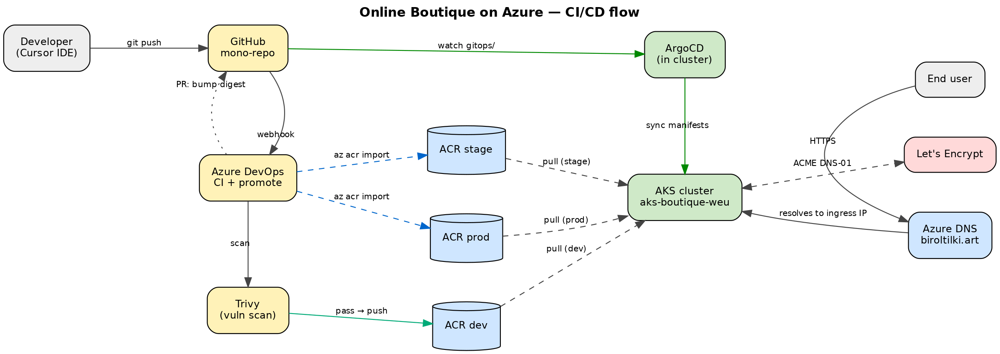
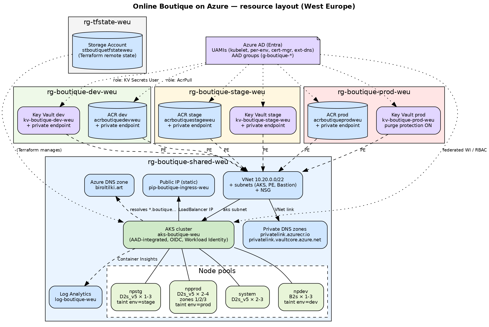
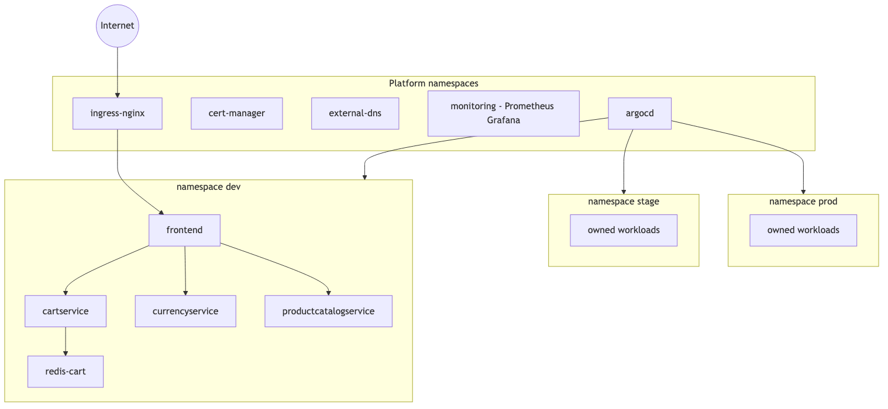

# Architecture Diagram & Tool Reference

**Owner:** *(your name — set when you fork this repo)*
**Created:** 2026-05-03
**Companion docs:** `architecture-design.md`, `cicd-pipeline-plan.md`

> **Current overview:** The platform diagram export in the main repo is **[`00-platform-overview.png`](../docs/diagrams/00-platform-overview.png)** (PNG). The sections below keep Mermaid source for inline editing; PNGs under `docs/diagrams/` match the rendered views.

This doc gives a visual map of the architecture (legacy three Mermaid diagrams from different angles, plus exported PNGs in the main `docs/diagrams/` tree) and a short reference for every tool in the stack with the connections between them.

> Tip: GitHub, Cursor, and most modern Markdown viewers render Mermaid blocks natively. If your viewer doesn't, paste the code into <https://mermaid.live>.

---

## Diagram 1 — High-level CI/CD flow

How a code change travels from the developer's keyboard to a running pod.

*Rendered export: [PNG](../docs/diagrams/01-cicd-flow.png) (in-repo under `docs/diagrams/`)*

---

## Diagram 2 — Azure resource layout

What Terraform creates in the subscription and how the resource groups are scoped.

*Rendered export: [PNG](../docs/diagrams/02-azure-resources.png)*

---

## Diagram 3 — Inside the AKS cluster

What's running inside the cluster, who controls what, and how traffic flows.

*Rendered export: [PNG](../docs/diagrams/03-inside-cluster.png)*

---

## Tool reference (short)

Tools grouped by role in the stack. Each entry: **what it is** · **why we use it** · **what it talks to**.

### Source control & development

- **GitHub** — Hosted Git, single mono-repo for app code, Helm charts, GitOps manifests, Terraform code, pipelines. Triggers Azure DevOps via webhook; serves as the source of truth ArgoCD pulls from.
- **Cursor IDE** — Where the developer writes code locally. Talks to GitHub via git.

### Infrastructure as Code

- **Terraform** — Provisions every Azure resource (VNet, AKS, ACR×3, KV×3, DNS, Log Analytics, UAMIs). State lives in an Azure Storage account; modules in `infra/terraform/modules/`, env stacks in `infra/terraform/envs/`.
- **HCL** — Terraform's config language. Used in `*.tf` files only.
- **Azure Storage (TF backend)** — Holds remote state, versioned and soft-deleted. Created once by the bootstrap stack.

### CI/CD

- **Azure DevOps** — Runs CI (build/lint/test/scan/push) and the promotion pipeline (`az acr import` between env-scoped ACRs). Service connections use Workload Identity Federation — no PATs.
- **Trivy** — Container image vulnerability scanner. Gates the CI pipeline on HIGH/CRITICAL CVEs before pushing to ACR.
- **ArgoCD** — In-cluster GitOps agent. Watches the `gitops/` folder in GitHub and reconciles cluster state to match. Uses an app-of-apps pattern with one `AppProject` per env.

### Containers & registries

- **Docker** — Container build engine in CI. Multi-stage Dockerfiles for each microservice.
- **Azure Container Registry (ACR) × 3** — One registry per environment (`acrboutiquedev/stage/prod weu`). CI pushes to dev only; promotion uses `az acr import` to copy the immutable digest into stage and prod ACRs.

### Cluster & orchestration

- **Azure Kubernetes Service (AKS)** — Managed Kubernetes. AAD-integrated, OIDC issuer + Workload Identity enabled, Azure CNI Overlay, CSI Secrets Store add-on. Single cluster, three logical environments separated by namespace + node pool.
- **Kubernetes** — The cluster runtime. Provides Deployments, Services, NetworkPolicies, ResourceQuotas, ServiceAccounts, etc.
- **Helm** — Package manager for K8s. Each microservice has its own chart in `charts/<svc>/`. ArgoCD renders charts using per-env values files.
- **kube-prometheus-stack** — Helm bundle that installs Prometheus, Grafana, Alertmanager, node-exporter, kube-state-metrics in one shot.

### Networking & ingress

- **Azure Virtual Network (VNet)** — Single VNet (`10.20.0.0/22`) with subnets for AKS nodes, private endpoints, and (optional) bastion.
- **Network Security Group (NSG)** — Layer-4 firewall on the AKS subnet; deny by default, allow only what's needed.
- **Azure Public IP (Standard, static)** — Stable public IP attached to the NGINX `LoadBalancer` Service so DNS records survive cluster rebuilds.
- **NGINX Ingress Controller** — L7 ingress in the cluster. Terminates TLS, routes hostnames to Services, force-redirects HTTP → HTTPS.
- **Azure DNS** — Public DNS zone for `example.com`. Records created automatically by external-dns based on Ingress annotations.
- **external-dns** — In-cluster controller that watches Ingress objects and writes matching A records to Azure DNS.
- **cert-manager** — Manages TLS certificate lifecycles. Requests certs from Let's Encrypt via the DNS-01 challenge against Azure DNS, then stores them as K8s Secrets that NGINX consumes.
- **Let's Encrypt** — Public ACME certificate authority. Issues free TLS certs (90-day lifetime) including wildcards.
- **Private endpoints + private DNS zones** — Keep ACR and Key Vault traffic inside the VNet (no public exposure). Two private DNS zones (`privatelink.azurecr.io`, `privatelink.vaultcore.azure.net`) link the private IPs to the FQDNs.

### Identity, RBAC, secrets

- **Azure AD (Entra ID)** — Identity provider. AAD groups (`g-boutique-devs`, `-leads`, `-sre`) bind to AKS RBAC. Users authenticate kubectl via AAD.
- **User-Assigned Managed Identity (UAMI)** — Azure identities for workloads. We use one per env (`id-boutique-dev/stage/prod`) plus dedicated UAMIs for cert-manager, external-dns, and the AKS kubelet.
- **Workload Identity (federated credentials)** — Bridge between K8s ServiceAccounts and UAMIs via OIDC. Lets pods authenticate to Azure resources (Key Vault, DNS) without secrets.
- **Azure Key Vault × 3** — Env-scoped secret storage. RBAC mode, private endpoint, soft-delete on, purge protection on prod.
- **CSI Secrets Store driver + Azure provider** — In-cluster CSI driver that mounts Key Vault secrets as files in pods. Optional sync to native K8s `Secret` for charts that require it.

### Observability

- **Prometheus** — Metrics scraper. Scrapes pods, nodes, kube-state-metrics, NGINX, cert-manager. 15-day retention on PVC.
- **Alertmanager** — Routes alerts to email/Slack/PagerDuty (channel TBD).
- **Grafana** — Dashboards for cluster health, per-service RED metrics, ingress latency, cert expiry. AAD OAuth ideally.
- **Azure Log Analytics** — Receives container logs and AKS control-plane diagnostic logs via Container Insights.

### Application

- **Online Boutique** — Google's 11-service polyglot e-commerce demo (Go, Python, Node, Java, C#) plus a Redis cart store. Only `frontend` is exposed externally; everything else is `ClusterIP`.

### Cluster-level security

- **Pod Security Standards (PSS)** — Built-in K8s admission policy. `baseline` in dev, `restricted` in stage and prod.
- **NetworkPolicies** — Default-deny per namespace; explicit allow rules per service.
- **ResourceQuotas + LimitRanges** — Per-namespace CPU/memory caps so dev runaway can't starve prod.

---

## Tool relationships at a glance

| From | To | Why |
|---|---|---|
| Developer (Cursor) | GitHub | git push |
| GitHub webhook | Azure DevOps | trigger CI on push/PR |
| Azure DevOps CI | ACR dev | docker push (image with digest) |
| Azure DevOps CI | GitHub | open PR bumping image digest in `gitops/envs/dev/` |
| Azure DevOps promote | ACR stage / prod | `az acr import` (immutable digest) |
| GitHub `gitops/` | ArgoCD | Argo polls/watches via the GitHub repo |
| ArgoCD | AKS | apply manifests; reconcile state |
| ArgoCD | Helm | render chart templates with per-env values |
| Kubelet (AKS) | ACR (per env) | image pull via UAMI's `AcrPull` role |
| Pod (workload) | Key Vault (per env) | CSI Secrets Store driver fetches via Workload Identity |
| End user | Public IP | HTTPS request |
| Public IP | NGINX Ingress | LoadBalancer Service |
| NGINX Ingress | Pod (frontend) | L7 routing by hostname |
| cert-manager | Azure DNS | write TXT (DNS-01 challenge) |
| cert-manager | Let's Encrypt | request cert |
| Let's Encrypt | cert-manager | issue cert |
| external-dns | Azure DNS | create A records from Ingress hostnames |
| End user resolver | Azure DNS | resolve `*.boutique.example.com` |
| Domain registrar | Azure DNS | NS delegation (manual, one-time) |
| Prometheus | Pods + nodes | scrape metrics |
| Prometheus | Grafana | datasource |
| AKS | Log Analytics | container insights logs + control-plane diagnostics |
| Terraform | Azure Resource Manager | provision/update/destroy resources |
| Terraform | Azure Storage (TF state) | read/write state |
| Workload Identity | UAMI | OIDC federation; bridges K8s SA → Azure identity |
| AAD groups | AKS RBAC | bind users to namespace-scoped roles |
| AKS API | Azure AD | authenticate kubectl users |

---

## Reading order

1. **Diagram 1** to see the *path of a change* — code → image → cluster.
2. **Diagram 2** to understand *what's in Azure* and how it's grouped by resource group.
3. **Diagram 3** to see *what's running inside the cluster* and how traffic, secrets, and metrics flow.
4. **Tool reference** for any tool you need to look up by name.
5. **Relationships table** to answer "who talks to whom and over what."
