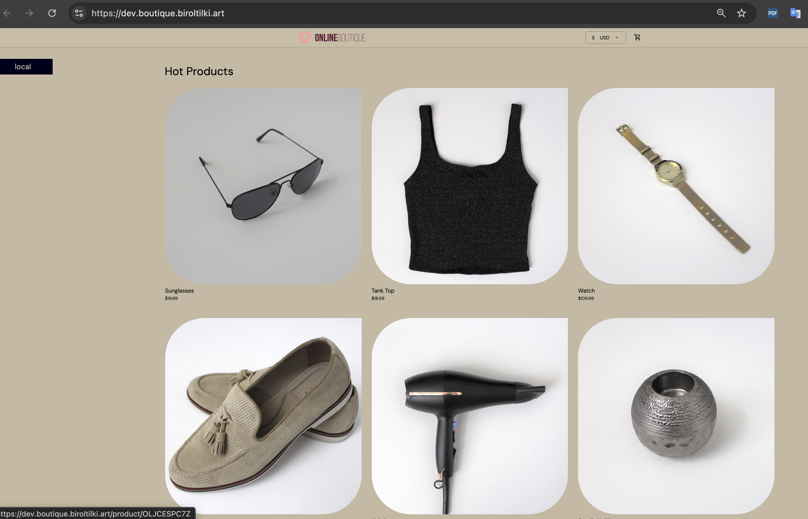

# Phase 3 — First service (`frontend`)

[← Phase 2](phase-02-cluster-bootstrap.md) · [Deployment](../../DEPLOYMENT.md) · [Phase 4 →](phase-04-promotion-pipeline.md)

**Goal:** Run the existing **frontend** pipeline so a new image digest lands in GitOps, Argo CD deploys to **dev**, and the storefront is reachable over **HTTPS**.

## Why this phase matters

- **CI** proves the path from commit → container → **dev ACR** without rebuilding on every environment.
- **GitOps** stores the **immutable digest** in Git; Argo CD is the only deploy mechanism to the cluster.
- **Ingress + cert-manager + external-dns** (Phase 2) turn the in-cluster Service into a public URL with TLS.

This repository already contains the chart, Argo `Application`, values file, and pipeline YAML. You **register and run** them — you do not create them from scratch unless you are experimenting.

## This repository (already present)

| Artifact | Path |
|----------|------|
| Helm chart | `charts/frontend/` |
| Dev Argo Application | `gitops/apps/dev/frontend-dev.yaml` (picked up by umbrella **`apps-dev`**) |
| Dev values (digest updated by CI) | `gitops/envs/dev/values-frontend.yaml` |
| CI pipeline | `pipelines/ci/frontend.yml` |
| Docker build context | `apps/frontend/Dockerfile` (scaffold image until you add real app source) |

**Important:** Keep `googleDemo.enabled: false` in values when using your own image from dev ACR. If `true` without Google demo services, the chart can route to an `ExternalName` and return **503**.

## Step-by-step

### 0) Pre-checks

```bash
az account show -o table
export KUBECONFIG=~/.kube/config-boutique   # or your kubeconfig path
kubectl get nodes
kubectl get applications -n argocd
kubectl get pods -n ingress-nginx,cert-manager,argocd
```

Confirm dev Terraform outputs (Phase 1):

```bash
cd infra/terraform/envs/dev && terraform output
```

### 1) Replace fork placeholders (if not done)

- `pipelines/ci/frontend.yml`: `GITHUB_REPOSITORY`, `AZURE_SUBSCRIPTION_CONNECTION`, ACR names if yours differ.
- GitOps `repoURL` values: your GitHub HTTPS URL (see [DEPLOYMENT.md — Fork setup](../../DEPLOYMENT.md#fork-setup-replace-placeholders)).
- `gitops/envs/dev/values-frontend.yaml`: `ingress.host` (e.g. `dev.boutique.<your-domain>`).

### 2) Register CI in Azure DevOps

**What “register” means:** The file `pipelines/ci/frontend.yml` already lives in GitHub. Azure DevOps does not run it until you create a **pipeline** object in the ADO UI that points at that YAML path. Registration is a one-time setup per service; later you only click **Run pipeline**.

**What the pipeline does when it runs** (for reference):

1. Checks out **this GitHub repo** (`checkout: self`).
2. Builds `apps/frontend/Dockerfile` and pushes the image to dev ACR **`acrboutiquedevweu`**.
3. Runs Trivy on the image.
4. Opens a GitHub PR that updates **`gitops/envs/dev/values-frontend.yaml`** with the new image digest.

YAML triggers are **off** (`trigger: none`), so pushes to `main` do **not** start this build—you start it manually from Azure DevOps.

---

#### 2a) Create the pipeline (point ADO at the YAML file)

In your Azure DevOps **project**:

1. Open **Pipelines** → **New pipeline** (or **Create Pipeline**).
2. Choose **GitHub** (not “Azure Repos Git”) unless you mirror the repo only into Azure Repos.
3. Select the **GitHub connection** / organization and authorize the **Azure Pipelines** GitHub App if prompted.
4. Pick **your fork** of this repository (the same repo that contains `pipelines/ci/frontend.yml`).
5. On **Configure your pipeline**, choose **Existing Azure Pipelines YAML file**.
6. Set **Branch** to `main` (or the branch you deploy from).
7. Set **Path** to:

   ```text
   /pipelines/ci/frontend.yml
   ```

8. **Continue** → review → **Save** (or **Run**). Give the pipeline a clear name, e.g. `ci-frontend`.

You now have one ADO pipeline per YAML file; repeat this pattern later for `pipelines/ci/cartservice.yml`, etc. (Phase 5).

---

#### 2b) Confirm the control repository (where ADO reads YAML and source)

The **control repository** is the GitHub repo Azure DevOps uses for:

- The pipeline definition (`pipelines/ci/frontend.yml`)
- `checkout: self` (Dockerfile, charts, GitOps paths on the agent)

**Check:**

1. **Pipelines** → open **`ci-frontend`** (or your name) → **Edit**.
2. At the **top of the editor**, confirm:
   - **Repository** = your GitHub fork (e.g. `your-org/microservice-apps-on-azure-using-terraform-helm-gitops-and-observability`), **not** a stale or template repo name.
   - **Branch** = `main`.

If the wrong repo appears: **⋮** next to the pipeline name → **Settings** / **Triggers** → change **repository** or reconnect GitHub. Details: [pipelines/README.md — pipeline source after a GitHub rename](../../pipelines/README.md#azure-devops-pipeline-source-after-a-github-rename).

**Match YAML to your fork:** In `pipelines/ci/frontend.yml`, variable **`GITHUB_REPOSITORY`** must be `your-org/your-repo` (GitHub slug). That is where the pipeline opens the digest-update PR—it can differ from the ADO display name but must match the repo you connected in 2a.

---

#### 2c) Variable group and `GITHUB_TOKEN` (GitHub PR step)

The job references:

```yaml
variables:
  - group: 'variable-group-for-microservices'
```

**Create or verify in Azure DevOps:**

1. **Pipelines** → **Library** → **+ Variable group**.
2. Name: **`variable-group-for-microservices`** (must match the YAML exactly).
3. Add a **secret** variable:
   - **Name:** `GITHUB_TOKEN`
   - **Value:** a GitHub **personal access token** (classic) or fine-grained token with at least:
     - **Contents:** read and write (to push a branch)
     - **Pull requests:** read and write (to open the PR)
     - Or classic scope: **`repo`** on the target repository
4. **Save** the variable group.
5. **Pipeline permissions:** On the variable group, **Pipeline permissions** → allow access for the **`ci-frontend`** pipeline (or “Grant access permission to all pipelines” during setup).

Without this token, the build may push to ACR but **fail** when creating the GitOps PR.

---

#### 2d) Service connection `promotion-azure-connection` (Azure login + ACR push)

The pipeline uses the **Azure Resource Manager** service connection named in YAML:

```yaml
AZURE_SUBSCRIPTION_CONNECTION: promotion-azure-connection
```

Steps run `az acr login`, `docker build`, and `docker push` under that identity.

**Create or verify in Azure DevOps:**

1. **Project settings** → **Service connections** → **New service connection** → **Azure Resource Manager** (Workload Identity Federation or Service principal—either is fine if configured for your subscription).
2. Name the connection **`promotion-azure-connection`** (or change the name in `pipelines/ci/frontend.yml` to match yours).
3. Scope it to the **subscription** where Terraform created **`acrboutiquedevweu`**.

**Azure RBAC (on the dev registry):** The service principal behind this connection needs **`AcrPush`** (and typically **`AcrPull`**) on registry **`acrboutiquedevweu`**. Terraform can grant this via `promotion_service_principal_object_id` in `infra/terraform/envs/dev/terraform.tfvars`; otherwise assign roles in Portal or CLI:

```bash
# Object ID = enterprise app behind the service connection (see ADO → Manage Service Principal)
az role assignment create \
  --assignee <SP_OBJECT_ID> \
  --role AcrPush \
  --scope $(az acr show -n acrboutiquedevweu --query id -o tsv)
```

If you renamed the ACR in Terraform, update **`DEV_ACR_NAME`** / **`DEV_ACR_LOGIN_SERVER`** in `pipelines/ci/frontend.yml` to match.

**Authorize the pipeline:** First run may prompt **Permit** for the service connection and variable group—approve so the job is not blocked.

---

#### 2e) Pre-flight Azure checks (optional, from your machine)

Confirm the registry exists before the first run:

```bash
az acr show -n acrboutiquedevweu -o table
az acr repository list -n acrboutiquedevweu -o table
```

### 3) Run CI and merge GitOps PR

1. **Run pipeline** manually (triggers are off in YAML by design).
2. After success, confirm image in ACR:

   ```bash
   az acr repository show-tags --name acrboutiquedevweu --repository frontend -o table
   ```

3. Open the GitHub PR created by the pipeline; verify only `gitops/envs/dev/values-frontend.yaml` changes and `image.digest` is `sha256:<64-hex>`.
4. **Merge** the PR to `main`.

Optional local render check before merge:

```bash
helm template frontend charts/frontend -f gitops/envs/dev/values-frontend.yaml
```

### 4) Argo CD and runtime verification

```bash
kubectl get application frontend-dev -n argocd
kubectl get deploy,po,svc,ing -n dev
kubectl get pod -n dev -o jsonpath='{range .items[*]}{.metadata.name}{" => "}{.spec.containers[*].image}{"\n"}{end}'
```

In Argo CD UI: **`frontend-dev`** → **Healthy** / **Synced**.

### 5) HTTPS and DNS

```bash
nslookup dev.boutique.example.com    # replace with your ingress.host
kubectl get certificate -n dev
curl -I https://dev.boutique.example.com
```

Expect **HTTP 200** (or app redirect) and a valid certificate chain once DNS and cert-manager DNS-01 have completed.

### 6) Optional — replace scaffold image with real frontend source

The shipped `apps/frontend/Dockerfile` builds a minimal nginx placeholder. To use the real Online Boutique UI:

1. Add source under `apps/frontend/` (subtree or copy from [microservices-demo](https://github.com/GoogleCloudPlatform/microservices-demo)) — see [apps/README.md](../../apps/README.md).
2. Update the Dockerfile and CI lint/test steps in `pipelines/ci/frontend.yml`.
3. Re-run CI and merge the new digest PR.

## Screenshots (validation)

### Boutique App Frontend Development is healthy and synced on Argo CD:


### Boutique Apps Frontend Development:



## Done checklist

- [ ] `pipelines/ci/frontend.yml` registered and a successful run pushed to **dev ACR**.
- [ ] GitOps PR merged; `gitops/envs/dev/values-frontend.yaml` has a real **digest**, not a placeholder.
- [ ] Argo CD **`frontend-dev`** is **Healthy** / **Synced**.
- [ ] `https://<dev-frontend-host>` returns success with valid TLS.
- [ ] Pods use the digest-form image reference (`...@sha256:...` or repo+digest per chart template).

---

[← Phase 2](phase-02-cluster-bootstrap.md) · [Deployment](../../DEPLOYMENT.md) · [Phase 4 →](phase-04-promotion-pipeline.md)
