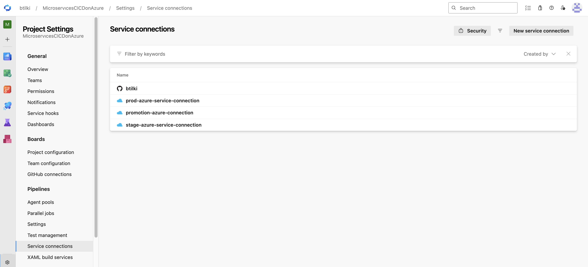
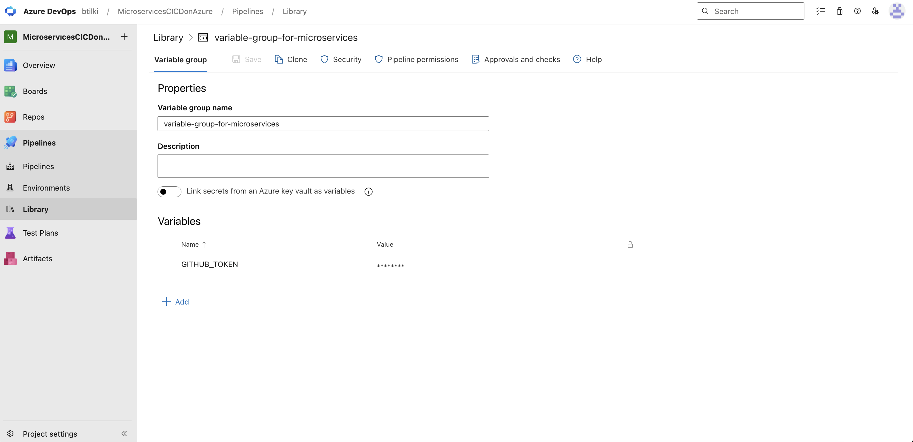
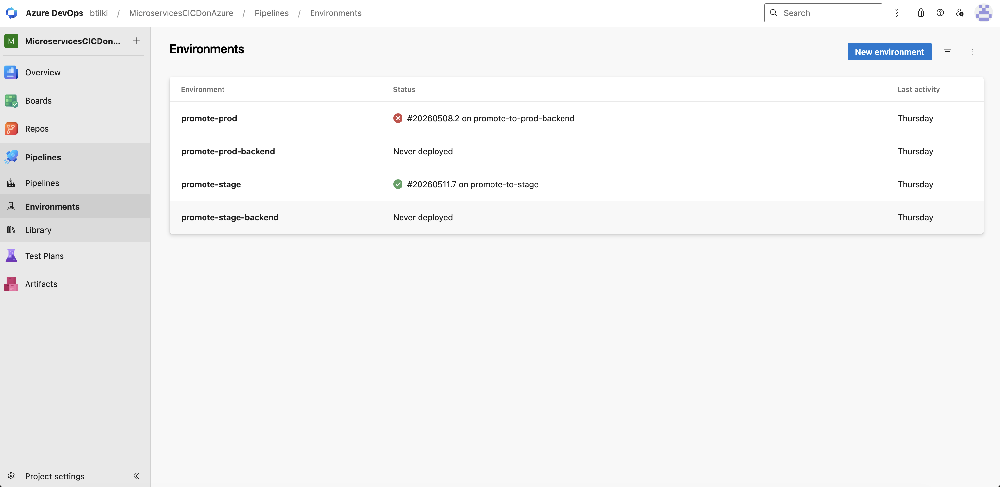
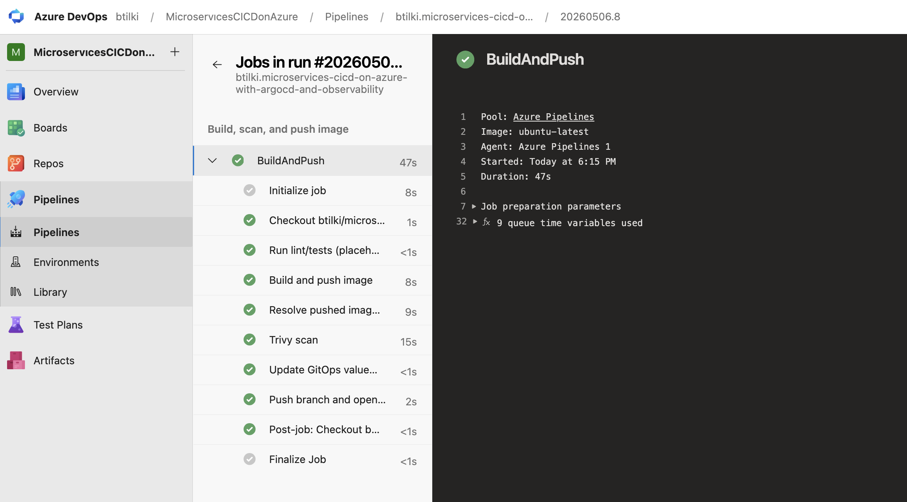
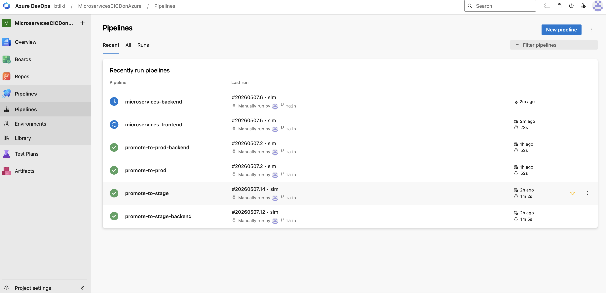

# Phase 4 — Promotion pipeline

[← Phase 3](phase-03-first-service-frontend.md) · [Deployment](../../DEPLOYMENT.md) · [Phase 5 →](phase-05-fan-out-services.md)

**Goal:** Promote images by digest across environments without rebuilding.

## Why this phase matters

Rebuilding images per environment risks drift. **`az acr import`** copies the same manifest digest from dev → stage → prod ACRs; GitOps values files record that digest; Argo CD deploys it. The shared template `pipelines/templates/promote-image.yml` enforces RBAC **before** import so failed promotions fail fast.

Pipeline YAML is already in `pipelines/promote/` — you configure Azure DevOps identities, environments, and run manual promotions.

## Process (brief)

Use one reusable promotion template and environment-specific wrappers. Each run imports a tested digest to target ACR, updates GitOps values, and opens a PR.

## Step-by-step

1. Verify promotion identity permissions — role matrix: [DEPLOYMENT.md — Promotion SP roles](../../DEPLOYMENT.md#promotion-service-principal-roles). Check assignments:
   ```bash
   az role assignment list --assignee <PRINCIPAL_ID_OR_APP_ID> -o table
   ```
2. In Azure DevOps, verify service connections and variable groups:
   - service connection can access source/target ACR
   - GitHub token is available for PR creation (secret **`GITHUB_TOKEN`** in `variable-group-for-microservices`)
   - promotion YAML fixes ACR login servers / names in-repo; at queue time you pick **`service`** (and optional **`digest`**). The **`digest`** parameter defaults to a single space so Azure DevOps does **not** show it as *Required*; leave that default (or clear the field) to read the digest from the source GitOps values file; paste `sha256:…` only when overriding.
3. Use `pipelines/templates/promote-image.yml` as the single shared promotion logic (RBAC pre-check, `az acr import`, GitOps YAML edit, GitHub PR to `main`).
4. Use wrapper pipelines (parameter **`service`** selects the owned workload; default `frontend`):
   - `pipelines/promote/promote-to-stage.yml`
   - `pipelines/promote/promote-to-prod.yml`
5. In Azure DevOps, configure environment approvals/checks:
   - `promote-stage` environment checks
   - `promote-prod` environment checks (required)
6. Run stage promotion pipeline manually and review generated GitHub PR:
   - confirm only `gitops/envs/stage/values-*.yaml` changed
   - confirm digest format is `sha256:<64-hex>`
   - merge after review
7. Verify stage ACR import and deployment:
   ```bash
   az acr manifest list-metadata --registry <STAGE_ACR_NAME> --name <SERVICE> -o table
   kubectl get applications -n argocd
   ```
8. Run prod promotion pipeline, complete approval gate, and review GitHub PR with stricter checks:
   - verify target repository is prod ACR
   - verify digest matches tested stage digest
   - merge only after required reviewers approve
9. Sync and verify prod:
   ```bash
   kubectl get applications -n argocd
   kubectl get pods -n prod
   ```
10. Confirm digest parity in GitOps values across environments for the promoted service.

## Detailed step-by-step guide (practical)

Use this sequence for **`frontend`** first, then the same pipelines with **`service`** set to each **v1 owned** workload (`cartservice`, `currencyservice`, `productcatalogservice`, `redis-cart`) once dev/stage/prod values files exist. To onboard a **new** image name, add it to the `values:` list on both promote wrappers (same string as ACR repository and `gitops/envs/*/values-<service>.yaml` suffix).

### 0) Prerequisites

1. Confirm access:
   ```bash
   az account show -o table
   kubectl get nodes
   kubectl get applications -n argocd
   ```
2. Confirm expected ACR names exist:
   ```bash
   az acr list -o table
   ```
   For this repository convention:
   - dev: `acrboutiquedevweu`
   - stage: `acrboutiquestageweu`
   - prod: `acrboutiqueprodweu`

### 1) Validate promotion identity permissions in Azure

1. Resolve the **service principal** backing the Azure Resource Manager service connection (connection id/name in YAML: `promotion-azure-connection`). The connection **name in DevOps is not** the app’s Azure AD **display name**.
   - **Azure DevOps:** Project settings → Service connections → `promotion-azure-connection` → **Manage Service Principal** (or “Azure Active Directory application”) to open the app registration and copy **Application (client) ID** or **Object ID**.
   - **Azure CLI:** use **application (client) id** or enterprise app **object id** with `az ad sp show --id ...`. For a known **display name**, use `az ad sp list --display-name '<NAME>' --query '[0].{appId:appId,objectId:id}' -o yaml` instead.
2. Verify role assignments (use **object id** or **app id** as supported by your CLI; object id is reliable for `az role assignment list`):
   ```bash
   az role assignment list --assignee <PRINCIPAL_ID_OR_APP_ID> -o table
   ```
3. Minimum expected access (must match what `pipelines/templates/promote-image.yml` **pre-checks** via wrapper parameters):
   - **Dev → stage** (`promote-to-stage.yml`):
     - source **dev** ACR: `AcrPull`
     - target **stage** ACR: `AcrPull` **and** `AcrPush` (both are validated)
     - **Reader** on resource groups: `rg-boutique-stage-weu`, `rg-boutique-prod-weu` (used so `az group show` succeeds during validation)
   - **Stage → prod** (`promote-to-prod.yml`):
     - source **stage** ACR: `AcrPull`
     - target **prod** ACR: `AcrPush`
     - **Reader** on the same two resource groups (as in repo wrappers)

### 1.1) Parameters when queuing a promotion

- **`service`** — which owned workload to promote (must match ACR repository name and `values-<service>.yaml` under `gitops/envs/{dev,stage,prod}/`). Shipped options: `frontend`, `cartservice`, `currencyservice`, `productcatalogservice`, `redis-cart`.
- **`digest`** (optional) — if empty, the template reads `digest:` from the **source** GitOps file for the chosen service (e.g. `gitops/envs/dev/values-<service>.yaml` for dev→stage). Set explicitly when `main` is not updated yet or you need an exact digest.

### 2) Validate Azure DevOps pipeline dependencies

1. Check service connection:
   - Azure DevOps -> Project settings -> Service connections
   - ensure `promotion-azure-connection` is authorized for promotion pipelines.

### Azure DevOps: Service connections:



2. Check variable group:
   - Azure DevOps -> Pipelines -> Library
   - ensure `variable-group-for-microservices` contains required values and secret `GITHUB_TOKEN`.

### Azure DevOps: Library variable group and GITHUB_TOKEN:



3. Check environments:
   - Azure DevOps -> Pipelines -> Environments
   - ensure `promote-stage` and `promote-prod` exist.
   - add approval checks on `promote-prod`.

### Azure DevOps: Promotion environments:



4. **Pipeline source (control repository)** — Each pipeline is tied to the GitHub repo chosen when it was created (`checkout: self`). If you renamed the GitHub repository, open **each** CI and promote pipeline → **Edit** and confirm the **repository** and **branch** in the header match the new GitHub URL (see [pipelines/README.md](../../pipelines/README.md) → **Azure DevOps pipeline source after a GitHub rename**).

### 3) Review pipeline YAML layout in repo

1. Shared promotion logic:
   - `pipelines/templates/promote-image.yml`
2. Wrapper pipelines:
   - `pipelines/promote/promote-to-stage.yml`
   - `pipelines/promote/promote-to-prod.yml`
3. Wrapper parameters (at queue time in Azure DevOps):
   - **`service`** — drives `imageName` and `gitops/envs/<env>/values-<service>.yaml` paths (see §1.1).
   - Fixed in YAML: `sourceAcrLoginServer` / `targetAcrName` / `targetAcrLoginServer`, `githubRepository`, `azureSubscriptionConnection`, `requiredReaderResourceGroups` (see §1).

Quick reference table: `pipelines/README.md` → **Promotion permissions control**.

### 4) Run stage promotion and verify PR

1. Queue `pipelines/promote/promote-to-stage.yml` manually in Azure DevOps. Set **`service`** (and **`digest`** if needed).
2. After success, open created GitHub PR and verify:
   - only `gitops/envs/stage/values-<service>.yaml` changed
   - image points to stage ACR
   - digest format is `sha256:<64-hex>`
3. Merge PR after review.

### 5) Verify stage import and rollout

1. Verify image exists in stage ACR:
   ```bash
   az acr manifest list-metadata --registry acrboutiquestageweu --name frontend -o table
   ```
2. Verify Argo status:
   ```bash
   kubectl get applications -n argocd
   kubectl get pods -n stage
   ```
3. Verify deployed image digest:
   ```bash
   kubectl get pod -n stage -o jsonpath='{range .items[*]}{.metadata.name}{" => "}{.spec.containers[*].image}{"\n"}{end}'
   ```

### 6) Run prod promotion with approval gate

1. Queue `pipelines/promote/promote-to-prod.yml` with the same **`service`** (and optional **`digest`**).
2. Complete required Azure DevOps environment approval (`promote-prod`).
3. Review generated GitHub PR:
   - only `gitops/envs/prod/values-<service>.yaml` changed
   - repository points to prod ACR
   - digest matches previously validated stage digest
4. Merge PR only after required reviewers approve.

### 7) Verify prod rollout and parity

1. Verify image exists in prod ACR:
   ```bash
   az acr manifest list-metadata --registry acrboutiqueprodweu --name frontend -o table
   ```
2. Verify cluster rollout:
   ```bash
   kubectl get applications -n argocd
   kubectl get pods -n prod
   ```
3. Confirm digest parity in GitOps:
   - compare digests between `gitops/envs/stage/values-<service>.yaml` and `gitops/envs/prod/values-<service>.yaml`
   - prod digest should equal approved stage digest for same release

### Azure CI pipeline build and push are success:



### Azure Pipelines recent runs:




## Done checklist

- Promotions run via pipeline and produce GitOps PRs.
- Stage and prod use imported digests (not rebuilt images).
- Promotion to prod is approval-gated.

---

[← Phase 3](phase-03-first-service-frontend.md) · [Deployment](../../DEPLOYMENT.md) · [Phase 5 →](phase-05-fan-out-services.md)
