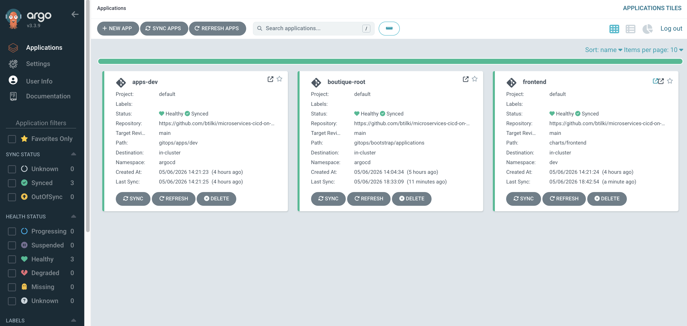

# Phase 5 — Fan-out remaining services

[← Phase 4](phase-04-promotion-pipeline.md) · [Deployment](../../DEPLOYMENT.md) · [Phase 6 →](phase-06-stage-environment.md)

**Goal:** Complete **v1** application coverage in `dev`: all **owned** services use this repo’s CI/GitOps; the **rest of the boutique path** can use **upstream Google** images when you choose to wire them in.

Workload scope (owned vs upstream): [ARCHITECTURE.md — Application scope](../../ARCHITECTURE.md#application-scope-v1). Promotion uses the **`service`** parameter on `pipelines/promote/promote-to-*.yml` (Phase 4).

## Paths in this repository

For the five **owned** workloads, the following already exist unless you intentionally removed them:

| Service | Chart | Dev Application | CI pipeline |
|---------|--------|-----------------|-------------|
| `frontend` | `charts/frontend` | `gitops/apps/dev/frontend-dev.yaml` | `pipelines/ci/frontend.yml` |
| `redis-cart` | `charts/redis-cart` | `gitops/apps/dev/redis-cart-dev.yaml` | `pipelines/ci/redis-cart.yml` |
| `productcatalogservice` | `charts/productcatalogservice` | `gitops/apps/dev/productcatalogservice-dev.yaml` | `pipelines/ci/productcatalogservice.yml` |
| `currencyservice` | `charts/currencyservice` | `gitops/apps/dev/currencyservice-dev.yaml` | `pipelines/ci/currencyservice.yml` |
| `cartservice` | `charts/cartservice` | `gitops/apps/dev/cartservice-dev.yaml` | `pipelines/ci/cartservice.yml` |

**Argo CD wiring:** `gitops/bootstrap/applications/apps-dev.yaml` defines Application **`apps-dev`**, which syncs the **directory** `gitops/apps/dev/` into the `argocd` namespace. Any new `*-dev.yaml` Application manifest dropped in that folder is picked up automatically — you do **not** add one file per microservice under `gitops/bootstrap/applications/` for dev.

**Stage / prod:** `apps-stage.yaml` and `apps-prod.yaml` sync `gitops/apps/stage/` and `gitops/apps/prod/` respectively. Manifest names there differ (e.g. `cartservice.yaml`, metadata `name: cartservice-stage`); see existing files for the pattern.

**Platform baseline:** Application **`platform-dev`** syncs `gitops/platform/dev/` (`namespace.yaml`, `networkpolicy-baseline.yaml`, etc.).

## Process (brief)

For **owned** services: ensure real digests in GitOps (via CI or manual), run pipelines, merge PRs, validate pods. Replace placeholder Dockerfiles under `apps/<service>/` with real service builds when you are ready. For **upstream** demo paths: add Argo `Application` manifests + values (or a parent chart) when you need a full Google demo topology.

## Step-by-step

### Prerequisites

1. Confirm Phase 4 promotion flow works for at least one owned service (e.g. `frontend`) using `pipelines/promote/promote-to-stage.yml` / `promote-to-prod.yml` and the **`service`** parameter.
2. Confirm `dev` namespace and Argo root app are healthy:
   ```bash
   kubectl get ns dev
   kubectl get applications -n argocd
   ```

### Azure

3. Confirm dev ACR is reachable and repositories exist (or will exist after first CI push):
   ```bash
   az acr list -o table
   az acr repository list --name acrboutiquedevweu -o table
   ```

### Azure DevOps

4. For each **owned** service, **register** the CI pipeline in Azure DevOps (if not already): `pipelines/ci/<service>.yml`.
5. Pipeline shape (see `frontend` as reference): checkout → build → Trivy → push **dev** ACR → update `gitops/envs/dev/values-<service>.yaml` digest → open GitHub PR.
6. Validate service connections and secrets:
   - ARM service connection (e.g. `promotion-azure-connection`) can push to dev ACR
   - `GITHUB_TOKEN` in `variable-group-for-microservices` for PR creation

### GitHub / GitOps

7. Recommended rollout order (dependencies first):
   - `redis-cart`
   - `productcatalogservice`, `currencyservice`, `cartservice`
   - `frontend` (often already live from Phase 3)
8. Deploy **upstream** slice when you need full boutique journeys:
   - `checkoutservice`, `emailservice`, `paymentservice`, `shippingservice`, `recommendationservice`
   - `loadgenerator` (non-prod only)
   - omit `adservice` in v1 unless needed  
   You will add Argo Applications + values (or reuse upstream Helm/manifests); not all are pre-created in this repo.
9. For each **owned** service, repo layout to preserve:
   - Helm chart: `charts/<service>/`
   - Argo Application (dev): `gitops/apps/dev/<service>-dev.yaml` (`metadata.name` usually `<service>-dev`)
   - Values: `gitops/envs/dev/values-<service>.yaml` (and stage/prod counterparts for promotion)
10. **Do not** duplicate dev app registration under `gitops/bootstrap/applications/` per service — keep the single **`apps-dev`** umbrella unless you change GitOps design.
11. Run CI and review/merge digest PRs in small batches (2–3 services per wave).

### Argo CD / Kubernetes validation

12. After each PR batch merge:
    ```bash
    kubectl get applications -n argocd
    kubectl get pods -n dev
    kubectl get svc -n dev
    ```
13. Validate service-to-service traffic with a debug pod or port-forward when needed.
14. Keep only **`frontend`** (ingress entrypoint) publicly exposed in this phase unless you intentionally add more ingresses.
15. Keep **`loadgenerator`** on upstream images and out of prod unless policy allows.

### Boutique Apps Frontend (Dev, Stage, Prod) are healthy and synced on Argo CD:



## Done checklist

- [ ] All five owned `Application`s under **`apps-dev`** show **Healthy** / **Synced** (or acceptable progressing state).
- [ ] `kubectl get pods -n dev` shows **Ready** pods for owned releases you care about this phase.
- [ ] `gitops/envs/dev/values-*.yaml` for owned services use **immutable digests**, not placeholders, for images you intend to run.
- [ ] Optional: run `frontend` smoke test (`curl` / browser) toward `dev` ingress hostname.
- [ ] Optional: promote one non-frontend service through Phase 4 pipelines to validate **`service`** end-to-end.

---

[← Phase 4](phase-04-promotion-pipeline.md) · [Deployment](../../DEPLOYMENT.md) · [Phase 6 →](phase-06-stage-environment.md)
