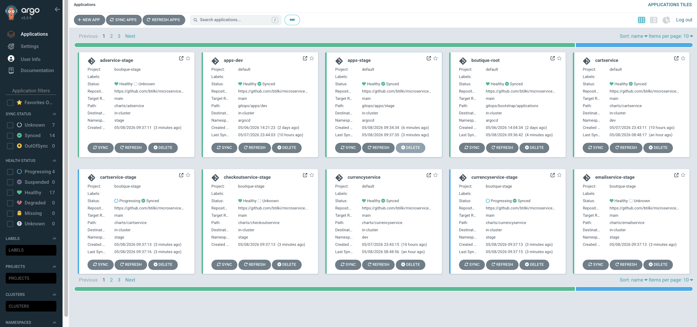
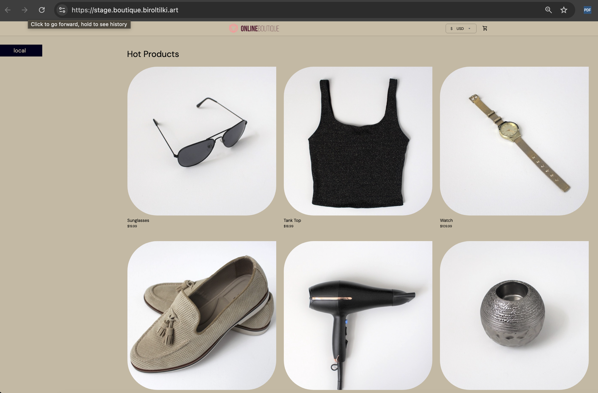

# Phase 6 — Stage environment

[← Phase 5](phase-05-fan-out-services.md) · [Deployment](../../DEPLOYMENT.md) · [Phase 7 →](phase-07-prod-environment.md)

**Goal:** Stand up and validate a stable **`stage`** namespace: platform guardrails, Argo CD **AppProject** boundaries, workloads using **stage ACR** images pinned by **digest**, and a reachable **HTTPS** entry (ingress + cert-manager) where you expose one.

## Why this phase matters

**Stage** is the last automated GitOps environment before prod: same cluster isolation patterns as prod, but Argo may auto-sync (unlike prod’s manual gate). Promotion pipelines update `gitops/envs/stage/values-*.yaml` so stage always runs images that were validated in dev.

## This repository

| Area | Path / resource |
|------|------------------|
| **Platform** (namespace, quota, limits, baseline **NetworkPolicy**) | `gitops/platform/stage/` — synced by Application **`platform-stage`** (`gitops/bootstrap/applications/platform-stage.yaml`) into namespace **`stage`**. |
| **Argo AppProject** (repo + destination guardrails) | `gitops/apps/stage/project-boutique-stage.yaml` — project **`boutique-stage`**. Sync-wave **`-1`** so it applies before stage `Application`s that reference it. |
| **Stage workloads** | `gitops/apps/stage/*.yaml` — synced by **`apps-stage`** (`gitops/bootstrap/applications/apps-stage.yaml`) into **`argocd`** (each child `Application` targets **`stage`**). |
| **Helm values** | `gitops/envs/stage/values-<service>.yaml` — image **`repository`** must use **stage** ACR (`acrboutiquestageweu.azurecr.io/...` for this project) and **`digest`**: `sha256:...`. |
| **Promotion** | Phase 4: `pipelines/promote/promote-to-stage.yml` + parameter **`service`** updates stage values and opens a GitHub PR. |

Root Application **`boutique-root`** syncs `gitops/bootstrap/applications/`; you do **not** register each stage app separately in bootstrap beyond **`platform-stage`** and **`apps-stage`**.

## Process (brief)

1. Confirm **Terraform** stage env and **stage ACR** exist (Phase 1).  
2. Ensure the cluster can **pull** from stage ACR (`AcrPull` / `aks attach-acr`).  
3. **Promote** owned images dev → stage (Phase 4), merge GitOps PR.  
4. **Argo** syncs `platform-stage` then **`apps-stage`** children; validate pods and HTTPS.

## Step-by-step

### Prerequisites

1. **`dev`** stable and Phase 4 **promote-to-stage** verified for at least one **`service`**.
2. Cluster can reach **stage** ACR (same pattern as dev):
   ```bash
   az aks update -g rg-boutique-shared-weu -n aks-boutique-weu --attach-acr acrboutiquestageweu
   ```
   Adjust resource group / cluster / registry names if yours differ.
3. Namespace will be created by Argo if missing; optional check:
   ```bash
   kubectl get ns stage
   ```

### Azure

4. **Stage ACR network:** Terraform sets **`public_network_access_enabled = true`** on **stage** ACR (same idea as dev in Phase 3) so **`az acr`** from the internet works. The ACR module **always uses SKU Premium** (private endpoint is always attached; Azure returns **409** if Terraform tries to switch that registry to **Standard** while PEs exist). Run **`terraform apply`** in `infra/terraform/envs/stage` after pulling this change.

5. Confirm **stage** ACR exists and holds promoted repositories (name **`acrboutiquestageweu`**):
   ```bash
   az acr list -o table
   az acr repository list --name acrboutiquestageweu -o table
   ```

### GitHub / GitOps

6. **Platform guardrails** under `gitops/platform/stage/`: `namespace.yaml`, `resourcequota.yaml`, `limitrange.yaml`, **`networkpolicy-baseline.yaml`** — ingress only from pods in **`stage`** and from namespace **`ingress-nginx`** (label `kubernetes.io/metadata.name: ingress-nginx`).
7. **AppProject** `gitops/apps/stage/project-boutique-stage.yaml`: `sourceRepos` and `destinations` limited to this repo and **`stage`** namespace.
8. **Child Applications** under `gitops/apps/stage/` use `spec.project: boutique-stage` and `valueFiles` pointing at `gitops/envs/stage/values-*.yaml`.
9. **Frontend / HTTPS:** `gitops/envs/stage/values-frontend.yaml` sets `ingress.host` (this repo: `stage.boutique.example.com`) and cert-manager TLS. **`googleDemo.enabled`** must be **`false`** when you run the real **frontend** image from stage ACR (same failure mode as dev: `ExternalName` → **503** if left `true` without Google demo services).

### Azure DevOps

10. Before promoting: **`promote-to-stage.yml`** targets **stage** ACR and correct GitOps paths; queue with the right **`service`** (and optional **`digest`**).
11. Promotion identity: **AcrPull** on dev ACR, **AcrPull** + **AcrPush** on stage ACR, **Reader** on RGs in wrapper (see `pipelines/README.md`).
12. Run **`pipelines/promote/promote-to-stage.yml`**, then **review and merge** the GitHub PR touching `gitops/envs/stage/`.

### Argo CD / Kubernetes validation

13. In Argo CD UI or CLI:
    ```bash
    kubectl get applications -n argocd
    kubectl get appproject boutique-stage -n argocd
    ```
    Expect **`platform-stage`**, **`apps-stage`**, and children such as **`frontend-stage`** **Synced** / **Healthy** (allow a short delay after PR merge).
14. Runtime:
    ```bash
    kubectl get pods,svc,ing -n stage
    ```
15. HTTPS smoke test (replace host with yours if different):
    ```bash
    curl -I https://stage.boutique.example.com
    ```
    Expect **HTTP 200** (or app redirect) and a **valid** Let’s Encrypt chain once cert-manager has issued **`frontend-stage-tls`**.

### Applications (dev and stage) in Argo CD:



### Boutique Apps Frontend on Stage Environment:



## Done checklist

- [ ] **`platform-stage`** and **`apps-stage`** (and owned children) are **Synced/Healthy**.
- [ ] Stage **images** use **`acrboutiquestageweu.azurecr.io/...`** (or your stage login server) and **immutable digests**.
- [ ] **`curl -I`** (or browser) to the stage ingress host succeeds with **valid TLS** where required.
- [ ] Optional: promoted at least two **`service`** values through **`promote-to-stage`** to validate the full loop.

---

[← Phase 5](phase-05-fan-out-services.md) · [Deployment](../../DEPLOYMENT.md) · [Phase 7 →](phase-07-prod-environment.md)
