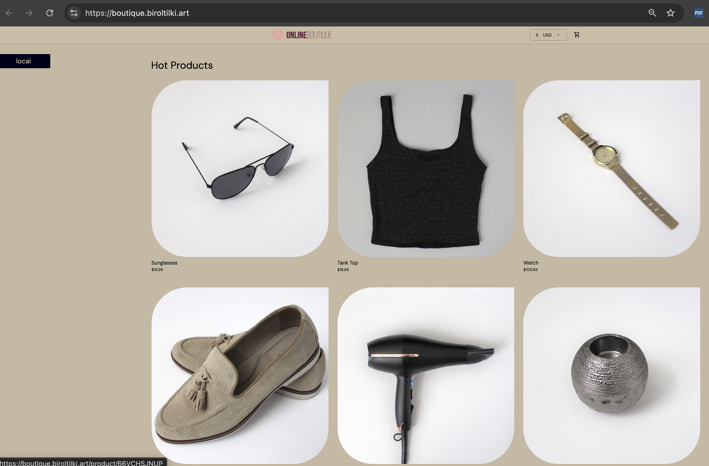

# Phase 7 — Prod environment

[← Phase 6](phase-06-stage-environment.md) · [Deployment](../../DEPLOYMENT.md) · [Phase 8 →](phase-08-hardening.md)

**Goal:** Operate **prod** with strict Git review, **manual** Argo CD sync, working alerts, and rehearsed rollback — using manifests and pipelines already in this repo.

## Why prod differs from dev/stage

| Control | Reason |
|---------|--------|
| **Manual Argo sync** | Git merge does not automatically roll out prod; an operator explicitly syncs after review. |
| **Separate prod ACR** | Images are promoted by digest from stage; prod never rebuilds from source in the promote path. |
| **`boutique-prod` AppProject** | Restricts which repos and namespaces prod Applications may target. |
| **Stronger GitHub rules** | `CODEOWNERS` + branch protection on `gitops/apps/prod/**` and `gitops/envs/prod/**`. |
| **Alertmanager routes** | On-call gets ingress 5xx, crash loop, and cert expiry signals. |

## This repository (already present)

| Area | Path / resource |
|------|------------------|
| **Platform** (namespace, quota, limits, NetworkPolicy, PriorityClass) | `gitops/platform/prod/` — Application **`platform-prod`** (`gitops/bootstrap/applications/platform-prod.yaml`), sync-wave **`1`**. |
| **AppProject + prod workloads** | `gitops/apps/prod/*.yaml` — **`apps-prod`** (`gitops/bootstrap/applications/apps-prod.yaml`), sync-wave **`0`**. **`project-boutique-prod.yaml`** has sync-wave **`-1`**. |
| **Helm values** | `gitops/envs/prod/values-<service>.yaml` — **`acrboutiqueprodweu.azurecr.io/...`** + **`digest`**. **`googleDemo.enabled: false`** on frontend. |
| **Promotion** | `pipelines/promote/promote-to-prod.yml` (Phase 4). |
| **Rollback digest log** | [prod-known-good-digests.md](../gitops/prod-known-good-digests.md) |
| **Runbooks** | [docs/runbooks/](../runbooks/README.md) |

**Manual sync:** Prod child `Application` manifests use **`syncOptions: [CreateNamespace=true]`** only — no **`syncPolicy.automated`**. After a GitOps PR merges, an operator **Sync**s each prod app in Argo CD.

## Step-by-step

### 0) Pre-checks

1. **Stage** is stable; you have promoted and tested at least one **`service`** through stage.
2. Attach prod ACR to the cluster kubelet identity:

   ```bash
   az aks update -g rg-boutique-shared-weu -n aks-boutique-weu --attach-acr acrboutiqueprodweu
   ```

3. Confirm promote pipeline and **`promote-prod`** environment approval exist in Azure DevOps.
4. **DNS / TLS:** Prod hostnames (e.g. `boutique.example.com` in `gitops/envs/prod/values-frontend.yaml`) must resolve to the ingress **LoadBalancer** IP. Certificates use **DNS-01** on ClusterIssuer `letsencrypt-prod` (Phase 2).

   ```bash
   kubectl get svc -A | grep -i ingress
   kubectl get ns prod
   az acr list -o table
   ```

Do not proceed if stage is unstable.

### 1) Verify platform and GitOps (no greenfield create)

Confirm bootstrap apps exist and root sync discovered prod:

```bash
kubectl get applications -n argocd | egrep 'platform-prod|apps-prod|frontend'
kubectl get appproject boutique-prod -n argocd
kubectl get networkpolicy,resourcequota,limitrange -n prod
```

Hard-refresh root if needed:

```bash
kubectl -n argocd annotate application boutique-root argocd.argoproj.io/refresh=hard --overwrite
```

Confirm prod apps have **no** automated sync:

```bash
kubectl get application -n argocd -l -o name 2>/dev/null || kubectl get applications -n argocd -o yaml | grep -E 'name:|automated' | head -40
```

Inspect a prod app explicitly:

```bash
kubectl get application frontend -n argocd -o yaml | grep -A2 syncPolicy
```

### 2) GitHub protections for prod paths

Follow **[Prod branch protection & approver teams](../gitops/prod-branch-protection.md)**:

- Replace `@YOUR_ORG/prod-gitops-approvers` and `@YOUR_ORG/prod-gitops-secondary` in **`CODEOWNERS`**.
- On `main`: require PR, code owner review, conversation resolution, no direct push.

### 3) Alertmanager and monitoring values

Reference: **`gitops/apps/platform/kube-prometheus-stack/values.yaml`**.

Replace `REPLACE_*` placeholders (Slack webhook, SMTP, on-call email) or wire secrets, then upgrade the stack if you changed values after Phase 2:

```bash
helm upgrade --install kube-prometheus-stack prometheus-community/kube-prometheus-stack \
  -n monitoring --create-namespace \
  -f gitops/apps/platform/kube-prometheus-stack/values.yaml
kubectl get pods -n monitoring
```

Test notification:

```bash
kubectl -n monitoring port-forward svc/kube-prometheus-stack-alertmanager 9093:9093
curl -sS -H "Content-Type: application/json" \
  -d '[{"labels":{"alertname":"BoutiqueManualTest","severity":"warning"},"annotations":{"summary":"Manual Alertmanager test"}}]' \
  http://127.0.0.1:9093/api/v2/alerts
```

Runbooks index: **[docs/runbooks/README.md](../runbooks/README.md)** (rollback, ingress 5xx, cert expiry, failing Argo sync).

### 4) Promote to prod (controlled release)

| YAML | Parameters |
|------|------------|
| `pipelines/promote/promote-to-prod.yml` | **`service`** — owned workload. **`digest`** — optional; empty reads from `gitops/envs/stage/values-<service>.yaml`. |

1. Queue pipeline on `main`; approve **`promote-prod`** environment.
2. Review GitHub PR: only `gitops/envs/prod/values-<service>.yaml` changes; digest `sha256:...`; repository `acrboutiqueprodweu.azurecr.io/<service>`.
3. Merge after required reviewers approve.

Verify ACR import:

```bash
SERVICE=frontend
az acr manifest list-metadata --registry acrboutiqueprodweu --name "$SERVICE" -o table
```

### 5) Manual Argo CD sync (human gate)

After PR merge:

1. Argo CD UI → select prod **`Application`**(s) → **Sync**.
2. CLI:

   ```bash
   kubectl get applications -n argocd
   kubectl get pods,ingress -n prod
   ```

### 6) Post-release verification

Use [release-verification.md](../runbooks/release-verification.md). Quick checks:

```bash
curl -sS -o /dev/null -w "frontend HTTP %{http_code}\n" -I https://boutique.example.com/
kubectl get pods -n prod
kubectl get certificate -n prod
```

Update **[prod-known-good-digests.md](../gitops/prod-known-good-digests.md)** after a good release.

### 7) Rollback (rehearse once)

See [prod rollback](../runbooks/prod-rollback.md): revert or PR new digest → merge → **manual Sync** → curl checks.

### Boutique Apps Frontend on Production Environment:



## Done checklist

- [ ] **`platform-prod`**, **`apps-prod`**, and owned prod children are configured; prod sync is **manual** only.
- [ ] Prod images use **`acrboutiqueprodweu`** digests promoted from stage (no rebuild in promote path).
- [ ] Branch protection and CODEOWNERS enforced on prod GitOps paths.
- [ ] Alertmanager test alert received on on-call channel.
- [ ] Runbooks linked from README; rollback **rehearsed**; known-good digests doc updated after a release.

---

[← Phase 6](phase-06-stage-environment.md) · [Deployment](../../DEPLOYMENT.md) · [Phase 8 →](phase-08-hardening.md)
