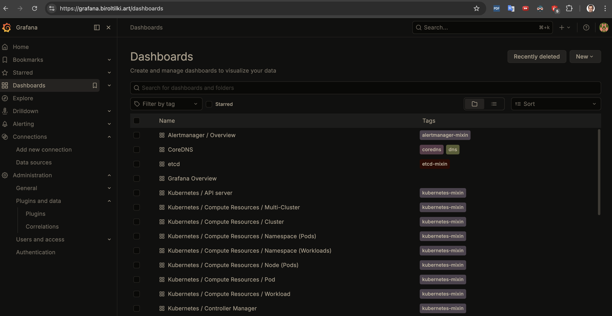
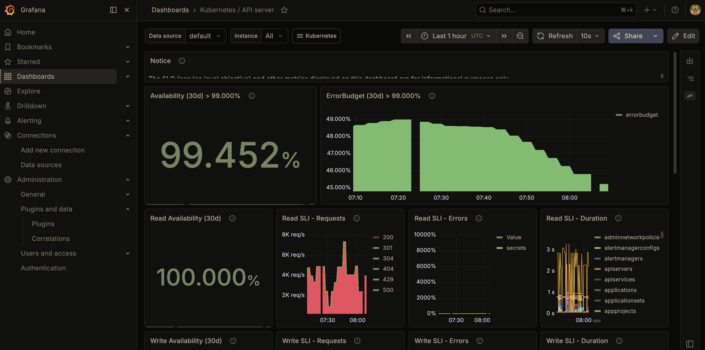

# Phase 9 — Polish

[← Phase 8](phase-08-hardening.md) · [Deployment](../../DEPLOYMENT.md) · [Phase 10 →](phase-10-destroy-infrastructure.md)

**Goal:** Make the project handover-ready with observability, smoke checks, and concise ops docs.

## Process (brief)

Finalize operator experience: dashboards for visibility, smoke tests for release confidence, and simple documentation for day-2 operations.

## Step-by-step

### Prerequisites

1. Ensure Phase 8 hardening controls are in place and stable.
2. Choose one low-risk service change for dry-run release validation.

### Azure / Observability

3. Use Grafana to build/import key dashboards:
   - cluster capacity
   - ingress latency/error rate
   - service health/restarts
   - certificate expiry

### Grafana: browse Kubernetes dashboards:

### Grafana: Kubernetes / API server dashboard:

4. Verify Alertmanager and dashboard links are accessible to on-call operators.

### GitHub / GitOps

5. Keep release verification checklist and troubleshooting links in `docs/runbooks/`.
6. Update root `README.md` with concise release flow and operations links.
7. Keep smoke script in repo (`scripts/smoke.sh`) and version changes through PR.

### Azure DevOps

8. Add smoke execution to release/promotion stages and fail pipeline on smoke failure.
9. Ensure pipeline surfaces smoke output clearly in logs/artifacts.

### Argo CD / Runtime validation

10. Perform one dry-run release (small change) and verify:
   - smoke checks pass
   - Argo is healthy
   - alerts remain normal after deployment

## Done checklist

- Dashboards are usable for release monitoring.
- Smoke checks are automated and fail on bad deployments.
- Documentation supports fast onboarding and operations.

**Artifacts:** [scripts/README.md](../../scripts/README.md) (`smoke.sh`), [docs/runbooks/](../runbooks/README.md), [DEPLOYMENT.md — Release flow](../../DEPLOYMENT.md#release-flow).

**Do manually:** import/build specific Grafana JSON in the UI if defaults are not enough; complete one dry-run release (small change) and confirm alerts stay normal (step 10 above).

---

[← Phase 8](phase-08-hardening.md) · [Deployment](../../DEPLOYMENT.md) · [Phase 10 →](phase-10-destroy-infrastructure.md)
